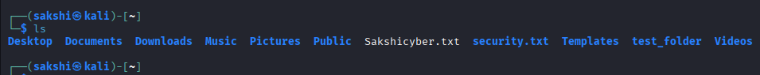
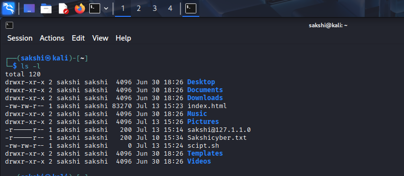
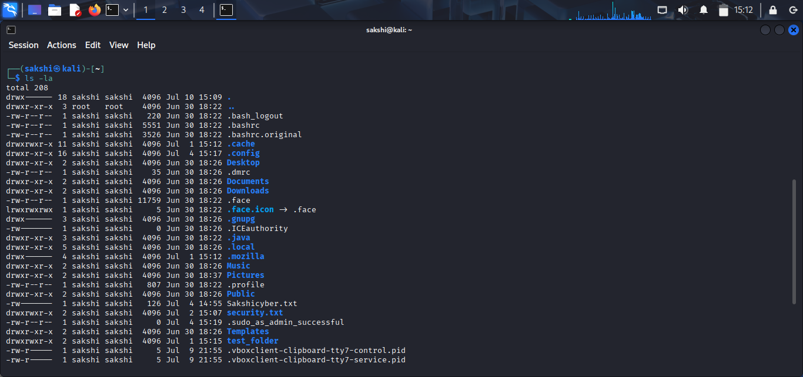
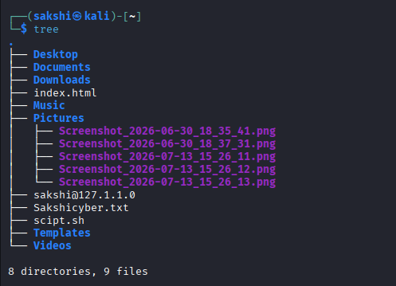

# Linux File System Practical

## 🎯 Objective

Learn how to navigate the Linux file system and use basic file system commands.

---

## 🧪 Lab Environment

- Operating System: Kali Linux
- Virtual Machine: VirtualBox
- Terminal: Bash

---

# 🖥️ Practical 1: List Files and Directories

## Command

```bash
ls
```

## Purpose

Displays the files and directories in the current directory.

## Screenshot

> 


## Explanation

The `ls` command lists all visible files and directories in the current working directory.

---

# 🖥️ Practical 2: List Files in Long Format

## Command

```bash
ls -l
```

## Purpose

Displays detailed information about files and directories.

## Screenshot

> 

## Explanation

The `ls -l` command shows file permissions, owner, group, file size, and last modification date.

---

# 🖥️ Practical 3: Show Hidden Files

## Command

```bash
ls -la
```

## Purpose

Displays all files, including hidden files.

## Screenshot

> 

## Explanation

The `-a` option displays hidden files (starting with `.`), while `-l` shows detailed information.

---

# 🖥️ Practical 4: Change Directory

## Command

```bash
cd
```

## Purpose

Changes the current working directory.

## Example

```bash
cd Desktop
```

## Screenshot

> 

## Explanation

The `cd` command allows you to move between directories.

---

# 🖥️ Practical 5: Return to Home Directory

## Command

```bash
cd ~
```

## Purpose

Returns to the current user's home directory.

## Screenshot

> 

## Explanation

The `~` symbol represents the current user's home directory.

---

# 🖥️ Practical 6: Move to Parent Directory

## Command

```bash
cd ..
```

## Purpose

Moves one level up from the current directory.

## Screenshot

> 

## Explanation

The `..` represents the parent directory.

---

# 🖥️ Practical 7: Display Current Directory

## Command

```bash
pwd
```

## Purpose

Displays the current working directory.

## Screenshot

> 


## Explanation

Useful for verifying your current location after changing directories.

---

# 🖥️ Practical 8: Display Directory Structure

## Command

```bash
tree
```

## Purpose

Displays files and directories in a tree-like structure.

## Screenshot

> 


## Explanation

The `tree` command provides a visual representation of the directory hierarchy.

> **Note:** If `tree` is not installed, install it using:
>
> ```bash
> sudo apt install tree
> ```

---

# 🏋️ Practice Tasks

- List files in your home directory.
- View hidden files.
- Navigate to the Desktop directory.
- Return to the home directory.
- Move to the parent directory.
- Display the current directory.
- View the directory structure using `tree`.

---

# ❓ Interview Questions

### Q1. What is the difference between `ls`, `ls -l`, and `ls -la`?

### Q2. What does the `cd` command do?

### Q3. What is the purpose of `cd ..`?

### Q4. What does the `~` symbol represent in Linux?

### Q5. Why is the `tree` command useful?

---

# 📚 Commands Covered

- `ls`
- `ls -l`
- `ls -la`
- `cd`
- `cd ~`
- `cd ..`
- `pwd`
- `tree`

---

# 🎯 Key Takeaway

These commands are the foundation of Linux file system navigation. Mastering them is essential for system administration, ethical hacking, penetration testing, and cybersecurity tasks.
