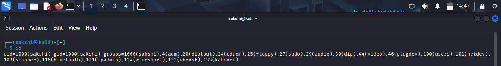
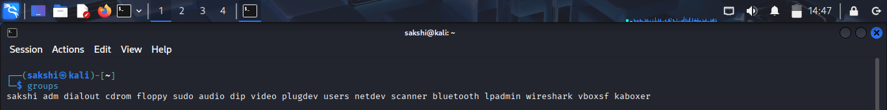
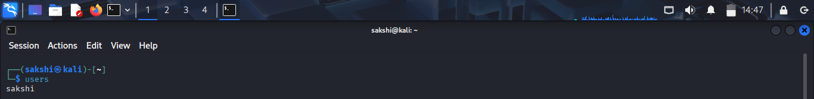
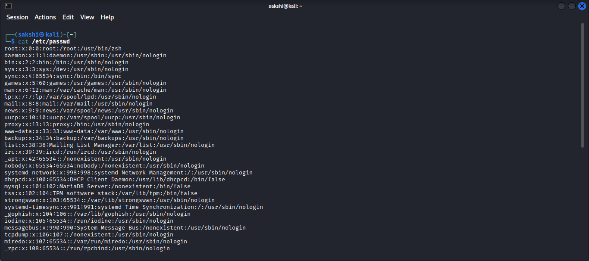
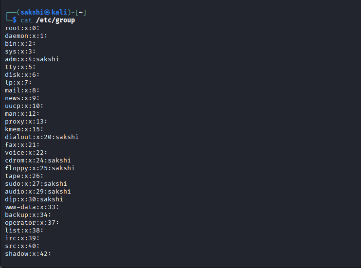
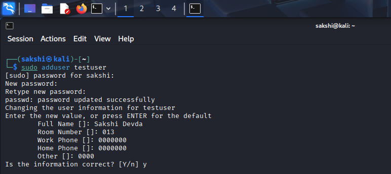
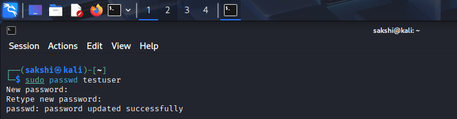
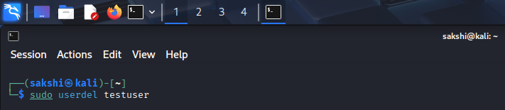

# Linux Users and Groups Practical

## 🎯 Objective

Learn how to identify users, groups, and user information using basic Linux commands.

---

## 🧪 Lab Environment

- Operating System: Kali Linux
- Virtual Machine: VirtualBox
- Terminal: Bash

---

# 🖥️ Practical 1: Check Current User

## Command

```bash
whoami
```

## Purpose

Displays the username of the currently logged-in user.

## Screenshot

> 

## Explanation

The `whoami` command shows the name of the current user.

---

# 🖥️ Practical 2: View Logged-in Users

## Command

```bash
who
```

## Purpose

Displays users currently logged into the system.

## Screenshot

> 

## Explanation

The `who` command shows active login sessions.

---

# 🖥️ Practical 3: Display User and Group Information

## Command

```bash
id
```

## Purpose

Displays the User ID (UID), Group ID (GID), and group memberships.

## Screenshot

> 

## Explanation

The `id` command provides detailed information about the current user.

---

# 🖥️ Practical 4: Display User Groups

## Command

```bash
groups
```

## Purpose

Displays the groups the current user belongs to.

## Screenshot

> 


## Explanation

The `groups` command lists all groups associated with the current user.

---

# 🖥️ Practical 5: Display Logged-in Usernames

## Command

```bash
users
```

## Purpose

Displays the usernames of users currently logged into the system.

## Screenshot

> 

## Explanation

The `users` command provides a simple list of logged-in usernames.

---

# 🖥️ Practical 6: View User Account Information

## Command

```bash
cat /etc/passwd
```

## Purpose

Displays information about all user accounts.

## Screenshot

> 

## Explanation

The `/etc/passwd` file contains usernames, UIDs, GIDs, home directories, and default shells.

---

# 🖥️ Practical 7: View Group Information

## Command

```bash
cat /etc/group
```

## Purpose

Displays information about all groups.

## Screenshot

> 

## Explanation

The `/etc/group` file stores group names, GIDs, and group members.

---

# 🖥️ Practical 8: Create a New User (Optional)

## Command

```bash
sudo adduser testuser
```

## Purpose

Creates a new user account.

## Screenshot

> 


## Explanation

The `adduser` command creates a new user and sets up a home directory.

> **Note:** Practice this only in your Kali Linux virtual machine.

---

# 🖥️ Practical 9: Change User Password (Optional)

## Command

```bash
sudo passwd testuser
```

## Purpose

Changes the password of a user account.

## Screenshot

> 


## Explanation

The `passwd` command updates the password for the specified user.

---

# 🖥️ Practical 10: Delete a User (Optional)

## Command

```bash
sudo userdel testuser
```

## Purpose

Deletes a user account.

## Screenshot

> 

## Explanation

The `userdel` command removes the specified user account.

> **Note:** Use only on test accounts.

---

# 🏋️ Practice Tasks

- Check your current username.
- Display your UID and GID.
- View the groups you belong to.
- Display the contents of `/etc/passwd`.
- Display the contents of `/etc/group`.

---

# ❓ Interview Questions

### Q1. What does the `id` command display?

### Q2. What is the purpose of the `groups` command?

### Q3. What information is stored in `/etc/passwd`?

### Q4. What information is stored in `/etc/group`?

### Q5. What is the difference between `who` and `whoami`?

---

# 📚 Commands Covered

- `whoami`
- `who`
- `id`
- `groups`
- `users`
- `cat /etc/passwd`
- `cat /etc/group`
- `sudo adduser`
- `sudo passwd`
- `sudo userdel`

---

# 🎯 Key Takeaway

Linux provides several commands to manage users and groups. Understanding user identities, group memberships, and account information is essential for secure system administration and cybersecurity.
