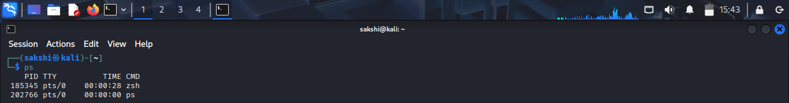
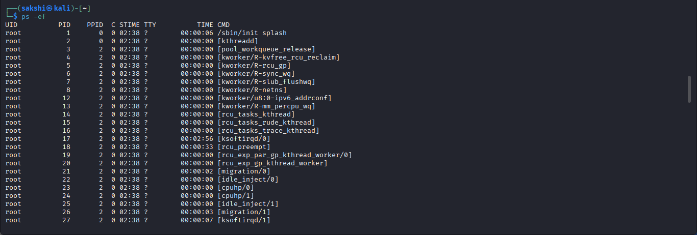
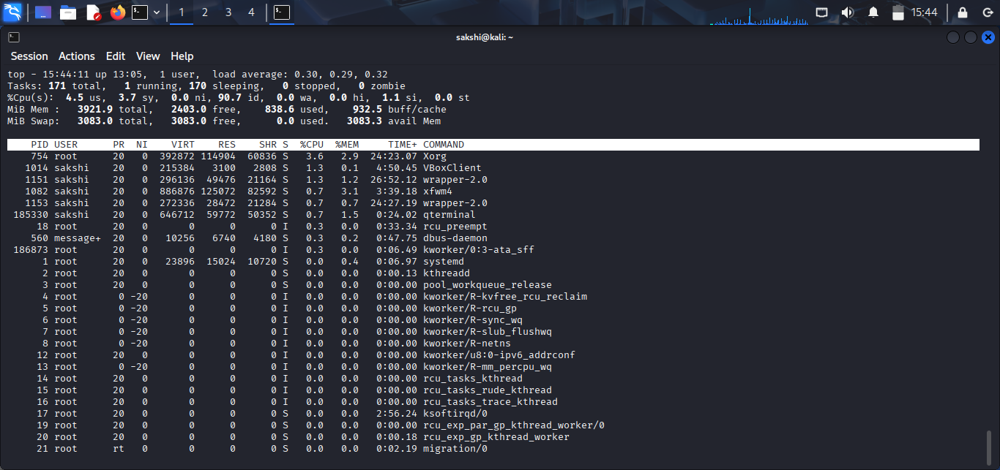
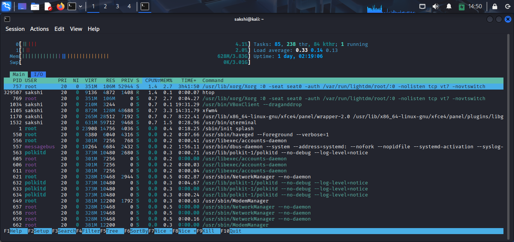
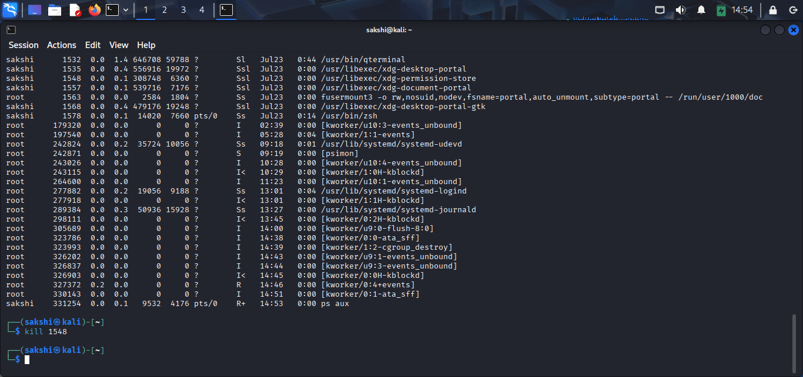
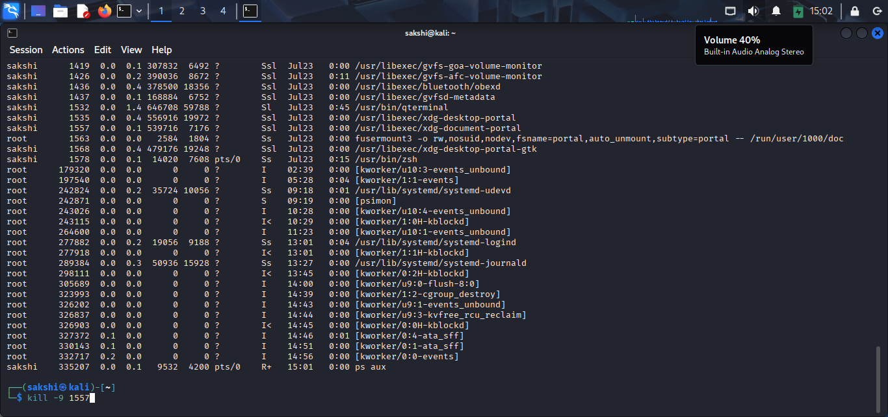
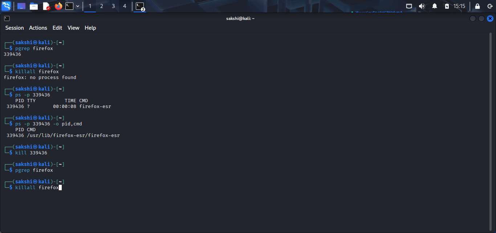
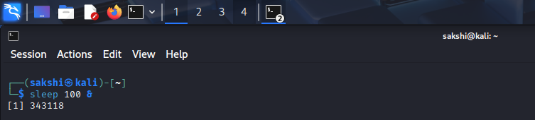
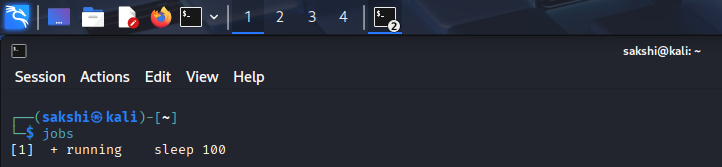

# Linux Process Management Practical

## 🎯 Objective

Learn how to monitor, analyze, and manage running processes in Linux using basic commands.

---

## 🧪 Lab Environment

- Operating System: Kali Linux
- Virtual Machine: VirtualBox
- Terminal: Bash

---

# 🖥️ Practical 1: View Running Processes

## Command

```bash
ps
```

## Purpose

Displays processes running in the current terminal session.

## Screenshot

> 

## Explanation

The `ps` command shows a snapshot of active processes.

---

# 🖥️ Practical 2: View All Processes

## Command

```bash
ps -ef
```

## Purpose

Displays all running processes in the system.

## Screenshot

> 

## Explanation

`ps -ef` provides detailed information like PID, PPID, and process owner.

---

# 🖥️ Practical 3: Monitor Processes in Real Time

## Command

```bash
top
```

## Purpose

Shows real-time system processes and resource usage.

## Screenshot

> 

## Explanation

`top` continuously updates process information like CPU and memory usage.

> **Exit:** Press `q`

---

# 🖥️ Practical 4: Interactive Process Viewer (Optional)

## Command

```bash
htop
```

## Purpose

Provides a user-friendly interface to monitor processes.

## Screenshot

> 

## Explanation

`htop` is an advanced version of `top` with better visualization.

> **Note:** If not installed:
```bash
sudo apt install htop
```

---

# 🖥️ Practical 5: Kill a Process by PID

## Command

```bash
kill <PID>
```

## Purpose

Terminates a process using its Process ID.

## Screenshot

> 

## Explanation

`kill` sends a termination signal to a process.

---

# 🖥️ Practical 6: Force Kill a Process

## Command

```bash
kill -9 <PID>
```

## Purpose

Forcefully stops a process.

## Screenshot

> 

## Explanation

Signal `-9` immediately terminates the process without cleanup.

---

# 🖥️ Practical 7: Kill Process by Name

## Command

```bash
killall firefox
```

## Purpose

Terminates all processes with the given name.

## Screenshot

> 

## Explanation

Useful when multiple instances of a program are running.

---

# 🖥️ Practical 8: Background Jobs

## Command

```bash
sleep 100 &
```

## Purpose

Runs a process in the background.

## Screenshot

> 

## Explanation

The `&` symbol sends the process to the background.

---

# 🖥️ Practical 9: View Background Jobs

## Command

```bash
jobs
```

## Purpose

Shows background processes in the current shell.

## Screenshot

> 

## Explanation

`jobs` lists processes running in the background.

---

# 🖥️ Practical 10: Bring Job to Foreground

## Command

```bash
fg %1
```

## Purpose

Moves a background job to the foreground.

## Screenshot

> 

## Explanation

`fg` is used to resume background jobs in active mode.

---

# 🏋️ Practice Tasks

- List all running processes.
- Start a background process using `sleep`.
- View system processes using `ps -ef`.
- Kill a test process using PID.
- Monitor system using `top`.
- Explore `htop` interface.

---

# ❓ Interview Questions

### Q1. What is the difference between `ps` and `top`?

### Q2. What does PID stand for?

### Q3. What is the purpose of `kill -9`?

### Q4. What is a background process?

### Q5. What does the `jobs` command do?

### Q6. Why is process management important in cybersecurity?

---

# 📚 Commands Covered

- `ps`
- `ps -ef`
- `top`
- `htop`
- `kill`
- `kill -9`
- `killall`
- `sleep &`
- `jobs`
- `fg`

---

# 🎯 Key Takeaway

Process management commands help you monitor system activity, control running processes, and troubleshoot performance issues. These skills are essential for Linux administrators and cybersecurity professionals.
