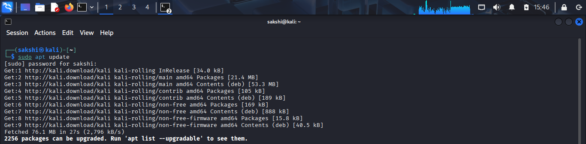
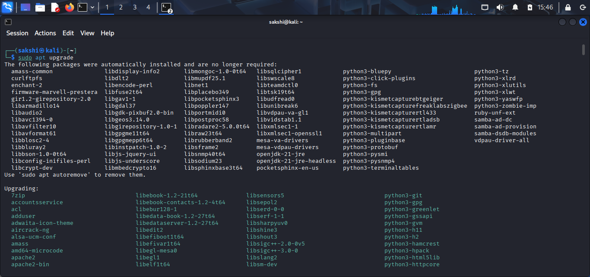
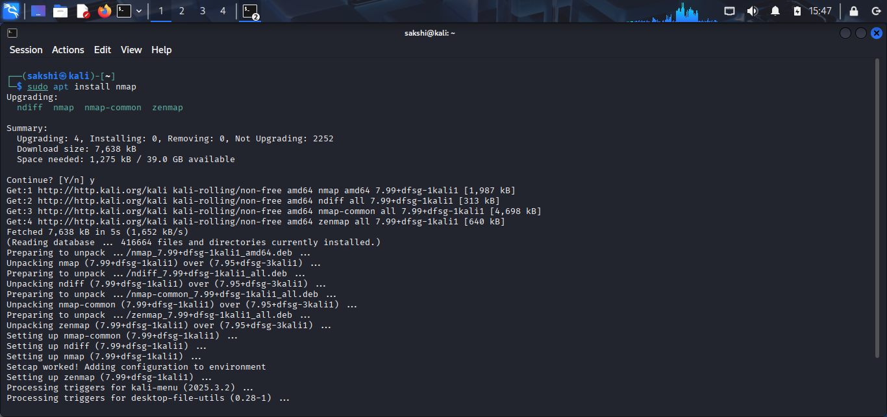
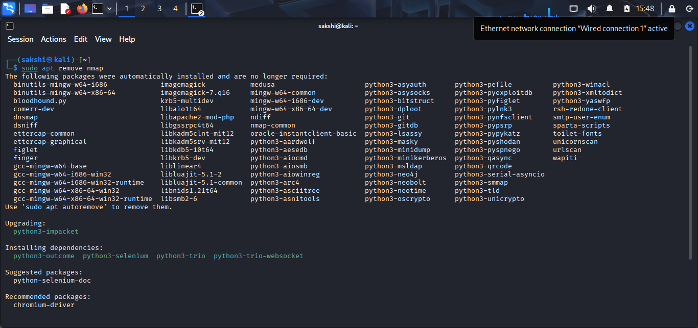
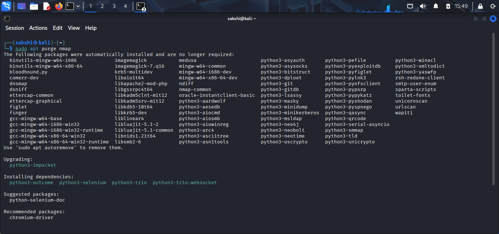
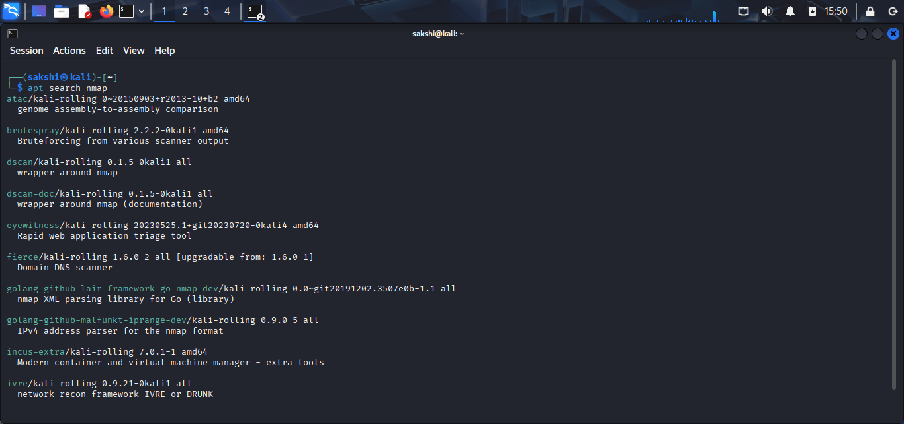
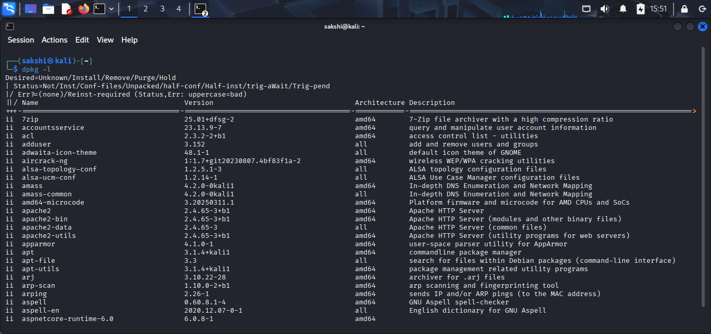

# Linux Package Management Practical

## 🎯 Objective

Learn how to install, update, remove, and manage software packages using APT in Linux.

---

## 🧪 Lab Environment

- Operating System: Kali Linux
- Virtual Machine: VirtualBox
- Terminal: Bash

---

# 🖥️ Practical 1: Update Package List

## Command

```bash
sudo apt update
```

## Purpose

Fetches the latest list of available packages from repositories.

## Screenshot

> 

## Explanation

This command updates the local package index so the system knows about the latest software versions.

---

# 🖥️ Practical 2: Upgrade System Packages

## Command

```bash
sudo apt upgrade
```

## Purpose

Upgrades all installed packages to their latest versions.

## Screenshot

> 

## Explanation

This command installs updates for all currently installed software.

---

# 🖥️ Practical 3: Install a Package

## Command

```bash
sudo apt install nmap
```

## Purpose

Installs new software on the system.

## Screenshot

> 

## Explanation

APT downloads and installs the package along with required dependencies.

---

# 🖥️ Practical 4: Remove a Package

## Command

```bash
sudo apt remove nmap
```

## Purpose

Removes installed software but keeps configuration files.

## Screenshot

> 

## Explanation

This command uninstalls the package but may leave config files behind.

---

# 🖥️ Practical 5: Purge a Package

## Command

```bash
sudo apt purge nmap
```

## Purpose

Completely removes software and its configuration files.

## Screenshot

> 

## Explanation

Use this when you want a clean removal of software.

---

# 🖥️ Practical 6: Search for a Package

## Command

```bash
apt search nmap
```

## Purpose

Searches for available packages in repositories.

## Screenshot

> 

## Explanation

Helps you find software before installing it.

---

# 🖥️ Practical 7: List Installed Packages

## Command

```bash
dpkg -l
```

## Purpose

Displays all installed packages on the system.

## Screenshot

> 

## Explanation

Shows a complete list of installed software with versions.

---

# 🏋️ Practice Tasks

- Update package list using `apt update`
- Install a small tool like `nmap`
- Check installed packages using `dpkg -l`
- Remove a test package using `apt remove`
- Search for any package using `apt search`

---

# ❓ Interview Questions

### Q1. What is the purpose of `apt update`?

### Q2. What is the difference between `apt remove` and `apt purge`?

### Q3. What does `apt upgrade` do?

### Q4. What is the role of `dpkg`?

### Q5. Why is package management important for system security?

---

# 📚 Commands Covered

- `apt update`
- `apt upgrade`
- `apt install`
- `apt remove`
- `apt purge`
- `apt search`
- `dpkg -l`

---

# 🎯 Key Takeaway

Package management in Linux helps install, update, and remove software efficiently. It is essential for maintaining system security, stability, and performance.
