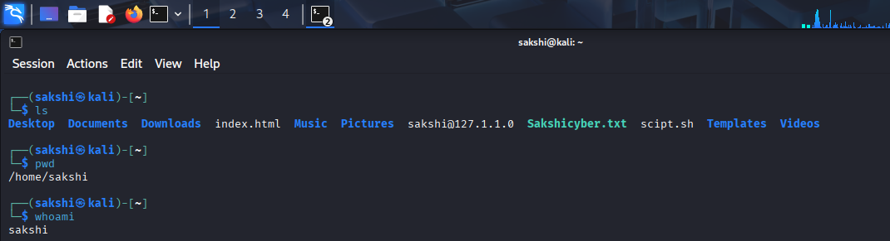
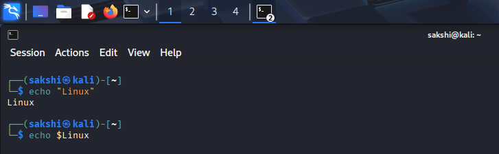
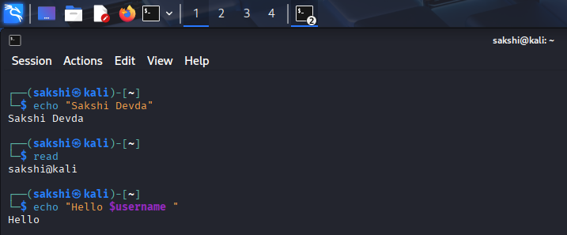
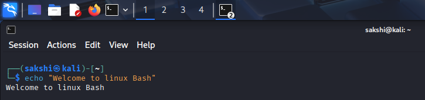
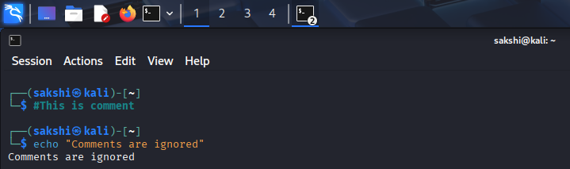
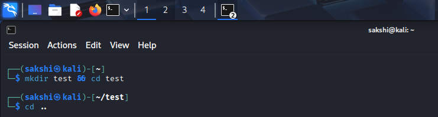
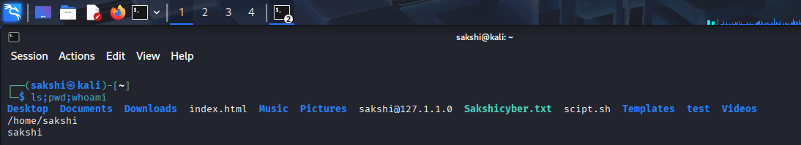

# Bash Basics Practical

## 🎯 Objective

Learn basic Bash commands, variables, input handling, and command execution in Linux.

---

## 🧪 Lab Environment

- Operating System: Kali Linux
- Virtual Machine: VirtualBox
- Terminal: Bash

---

# 🖥️ Practical 1: Run Basic Commands

## Commands

```bash
ls
pwd
whoami
```

## Purpose

Execute basic Linux commands using Bash shell.

## Screenshot

> 

## Explanation

Bash executes commands and returns output directly in the terminal.

---

# 🖥️ Practical 2: Create and Display Variables

## Commands

```bash
name="Linux"
echo $name
```

## Purpose

Stores and displays values using variables.

## Screenshot

> 

## Explanation

Variables in Bash store data that can be reused in scripts.

---

# 🖥️ Practical 3: Take User Input

## Commands

```bash
echo "Enter your name:"
read username
echo "Hello $username"
```

## Purpose

Takes input from the user and displays output.

## Screenshot

> 

## Explanation

`read` command stores user input into a variable.

---

# 🖥️ Practical 4: Use Echo Command

## Command

```bash
echo "Welcome to Linux Bash"
```

## Purpose

Displays output on the screen.

## Screenshot

> 

## Explanation

`echo` is used for printing messages.

---

# 🖥️ Practical 5: Use Comments in Bash

## Commands

```bash
# This is a comment
echo "Comments are ignored"
```

## Purpose

Adds explanations inside scripts.

## Screenshot

> 

## Explanation

Comments are not executed by the shell.

---

# 🖥️ Practical 6: Command Chaining

## Commands

```bash
mkdir test && cd test
```

## Purpose

Runs multiple commands together.

## Screenshot

> 

## Explanation

`&&` ensures the second command runs only if the first succeeds.

---

# 🖥️ Practical 7: Multiple Commands Execution

## Commands

```bash
ls; pwd; whoami
```

## Purpose

Runs multiple commands sequentially.

## Screenshot

> 

## Explanation

Each command runs one after another regardless of success or failure.

---

# 🏋️ Practice Tasks

- Run basic Linux commands in Bash
- Create a variable and display it
- Take user input using `read`
- Execute multiple commands in one line
- Practice using `echo`

---

# ❓ Interview Questions

### Q1. What is Bash used for?

### Q2. How do you create a variable in Bash?

### Q3. What is the use of `read` command?

### Q4. What is the difference between `;` and `&&`?

### Q5. Why is Bash important in cybersecurity?

---

# 📚 Commands Covered

- `ls`
- `pwd`
- `whoami`
- `echo`
- `read`
- `mkdir`
- `&&`
- `;`

---

# 🎯 Key Takeaway

Bash allows users to interact with Linux efficiently and automate tasks. It is an essential skill for system administration, cybersecurity, and scripting.
