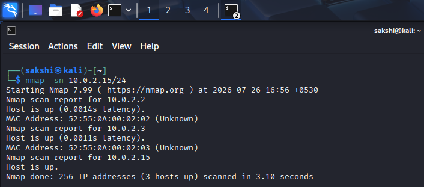
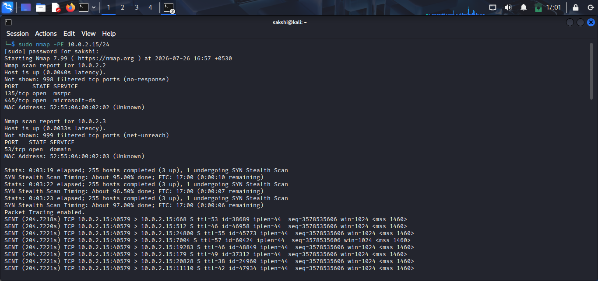
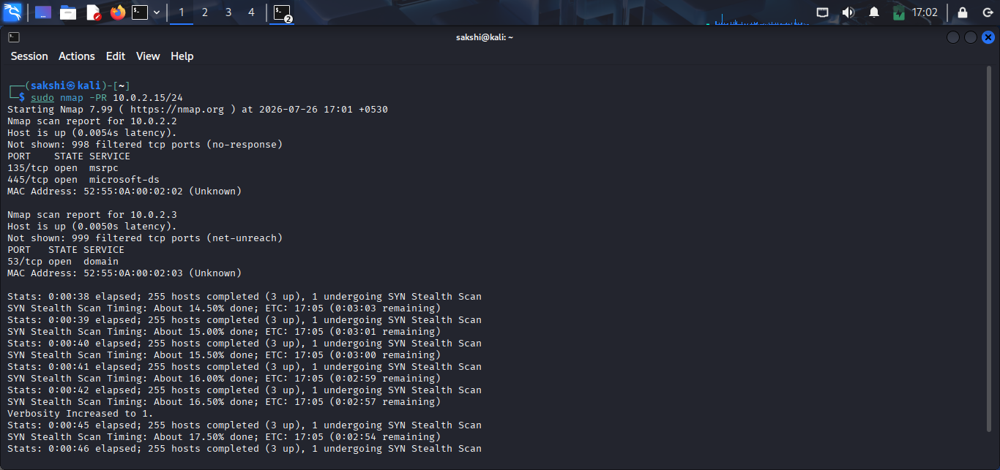
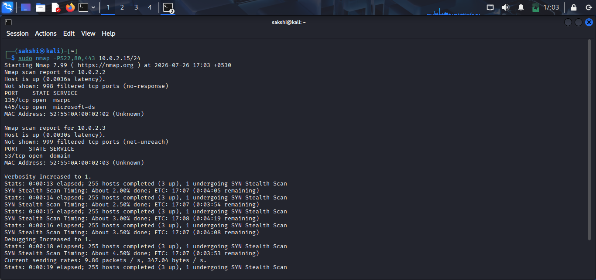
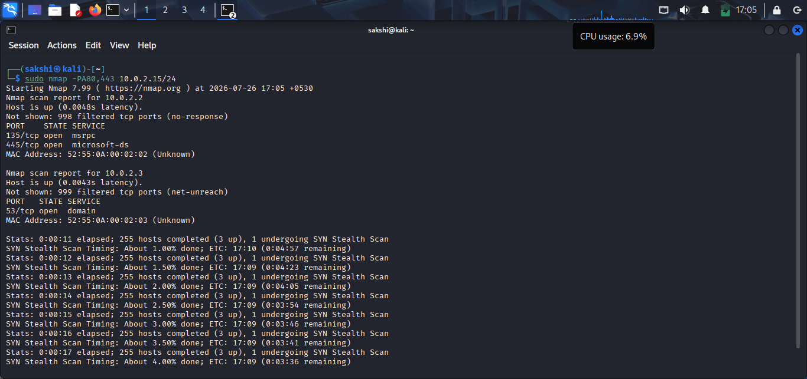
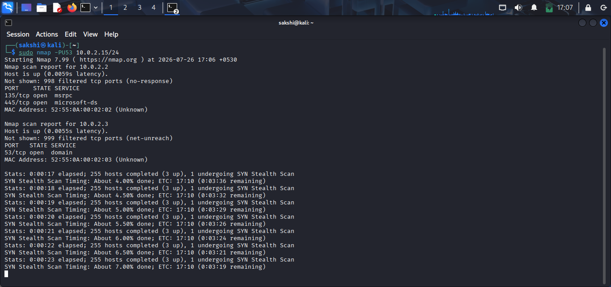

# Host Discovery Lab

## 🎯 Objective

In this lab, you will practice discovering live hosts on a network using different Nmap host discovery techniques.

---

# Lab Environment

- Operating System: Kali Linux
- Tool: Nmap
- Target: Your Local Network or TryHackMe Machine

---

# Task 1: Discover Live Hosts

## Command

```bash
nmap -sn <target-network>
```

### Example

```bash
nmap -sn 192.168.1.0/24
```

### Expected Result

- Displays all active hosts on the network.
- Does not scan ports.

> 

---

# Task 2: Perform an ICMP Ping Scan

## Command

```bash
sudo nmap -PE <target-network>
```

### Example

```bash
sudo nmap -PE 192.168.1.0/24
```

### Expected Result

Active hosts responding to ICMP Echo Requests are displayed.

> 

---

# Task 3: Perform an ARP Scan

## Command

```bash
sudo nmap -PR <target-network>
```

### Example

```bash
sudo nmap -PR 192.168.1.0/24
```

### Expected Result

Discovers live devices on the local network using ARP requests.

> 

---

# Task 4: Perform a TCP SYN Ping

## Command

```bash
sudo nmap -PS22,80,443 <target-network>
```

### Example

```bash
sudo nmap -PS22,80,443 192.168.1.0/24
```

### Expected Result

Identifies hosts that respond to TCP SYN packets.

> 

---

# Task 5: Perform a TCP ACK Ping

## Command

```bash
sudo nmap -PA80,443 <target-network>
```

### Example

```bash
sudo nmap -PA80,443 192.168.1.0/24
```

### Expected Result

Shows hosts that respond to TCP ACK packets.

> 

---

# Task 6: Perform a UDP Ping

## Command

```bash
sudo nmap -PU53 <target-network>
```

### Example

```bash
sudo nmap -PU53 192.168.1.0/24
```

### Expected Result

Discovers hosts responding to UDP probes.

> 

---

# Lab Summary

| Task | Status |
|------|--------|
| Host Discovery Scan | ✅ |
| ICMP Ping Scan | ✅ |
| ARP Scan | ✅ |
| TCP SYN Ping | ✅ |
| TCP ACK Ping | ✅ |
| UDP Ping | ✅ |

---

# What I Learned

- How to discover live hosts using Nmap.
- Different host discovery techniques.
- When to use ICMP, ARP, TCP, and UDP discovery methods.
- How Nmap identifies active devices before performing port scans.

---

# Challenge

Try scanning:

- Your local network.
- A TryHackMe target machine.
- The official Nmap test server (where appropriate).

Compare the results and observe how different discovery methods behave.

---

# Key Takeaway

Host Discovery is the first step in network reconnaissance. Identifying active devices before port scanning makes network assessments faster, more efficient, and less intrusive.
