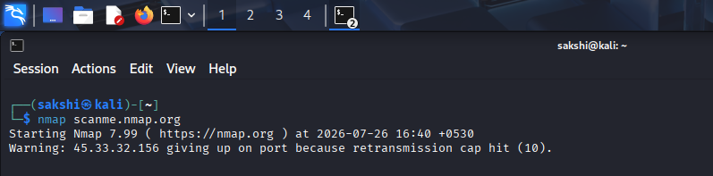
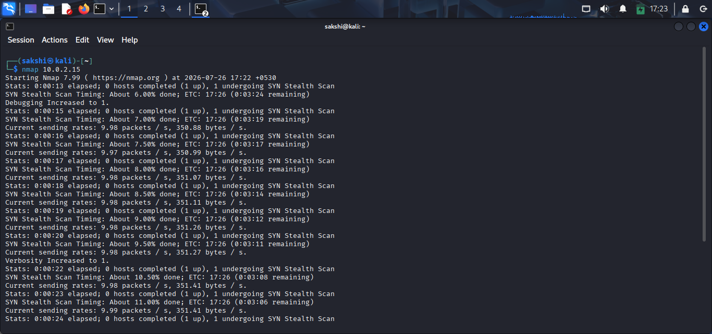
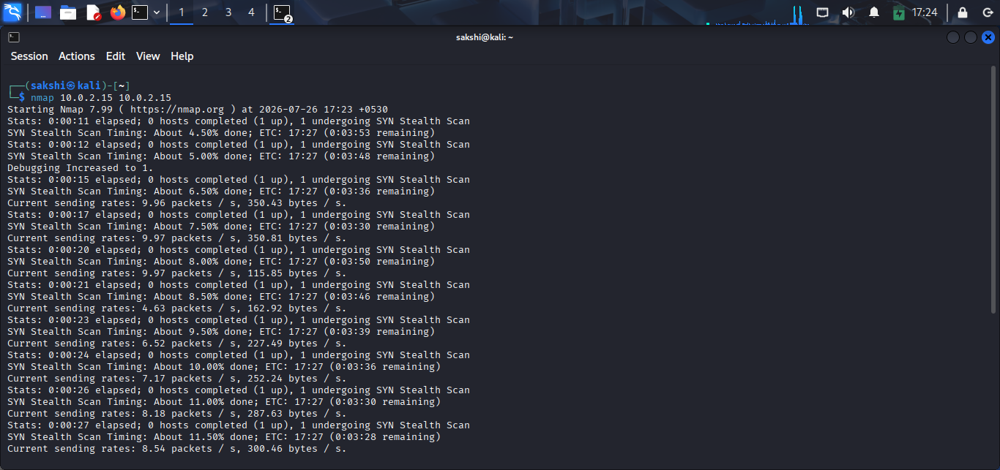
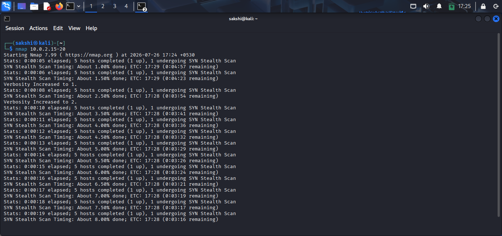
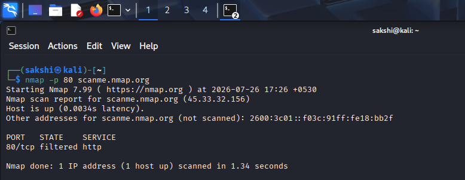
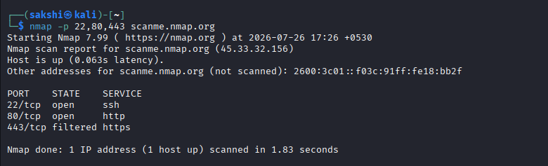
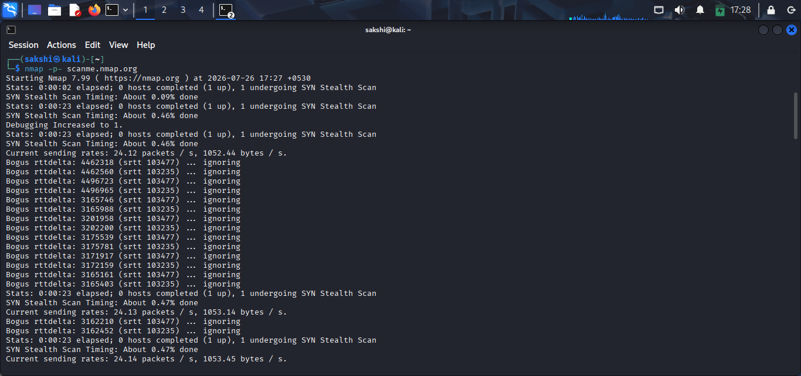

# Port Scanning (Practical)

## 🎯 Objective

In this practical, you will learn how to perform basic port scanning using Nmap and understand the scan results.

---

# Lab Environment

- Operating System: Kali Linux
- Tool: Nmap
- Target: scanme.nmap.org or Your Lab Machine

---

# Practical 1: Default Port Scan

## Command

```bash
nmap scanme.nmap.org
```

### Purpose

Performs a basic scan on the target and checks the most common ports.

### Expected Output

- Host status
- Open ports
- Service names

> 

---

# Practical 2: Scan a Specific IP Address

## Command

```bash
nmap 192.168.1.10
```

### Purpose

Scans the specified host for commonly used ports.

> 

---

# Practical 3: Scan Multiple Hosts

## Command

```bash
nmap 192.168.1.10 192.168.1.20
```

### Purpose

Scans multiple target hosts in a single command.

> 

---

# Practical 4: Scan a Range of IP Addresses

## Command

```bash
nmap 192.168.1.1-20
```

### Purpose

Scans all hosts within the specified IP range.

> 

---

# Practical 5: Scan a Specific Port

## Command

```bash
nmap -p 80 scanme.nmap.org
```

### Purpose

Scans only port 80 on the target.

> 

---

# Practical 6: Scan Multiple Ports

## Command

```bash
nmap -p 22,80,443 scanme.nmap.org
```

### Purpose

Scans only the specified ports.

> 

---

# Practical 7: Scan All Ports

## Command

```bash
nmap -p- scanme.nmap.org
```

### Purpose

Scans all 65,535 TCP ports.

> **Note:** This scan may take several minutes to complete.

> 

---

# Practical Summary

| Command | Purpose |
|---------|---------|
| `nmap scanme.nmap.org` | Default scan |
| `nmap <IP>` | Scan one host |
| `nmap <IP1> <IP2>` | Scan multiple hosts |
| `nmap <IP-Range>` | Scan a range of hosts |
| `nmap -p 80 <target>` | Scan one port |
| `nmap -p 22,80,443 <target>` | Scan selected ports |
| `nmap -p- <target>` | Scan all ports |

---

# Key Observations

- Nmap identifies open ports.
- Running services are displayed.
- Closed ports are usually not shown in a default scan.
- Full port scans take longer than default scans.

---

# Best Practices

- Scan only authorized systems.
- Start with a default scan before using advanced scans.
- Save scan results for future analysis.
- Review open ports and investigate unnecessary services.

---

# Practical Completed

- ✅ Default Port Scan
- ✅ Single Host Scan
- ✅ Multiple Host Scan
- ✅ IP Range Scan
- ✅ Specific Port Scan
- ✅ Multiple Port Scan
- ✅ Full Port Scan
