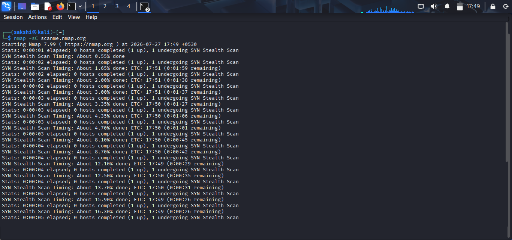
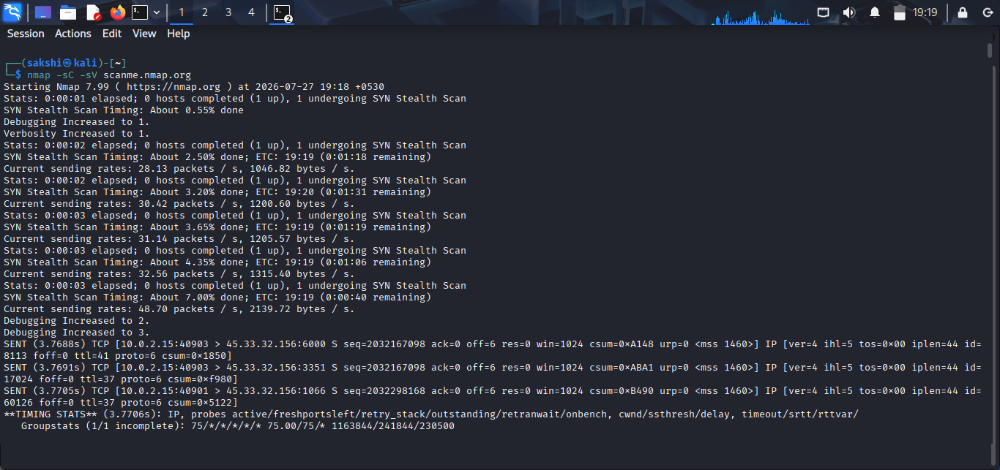
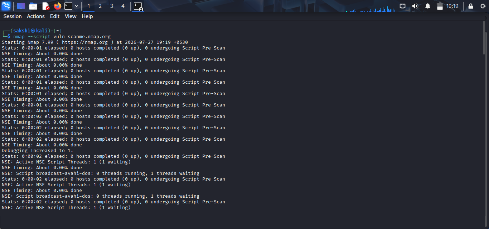
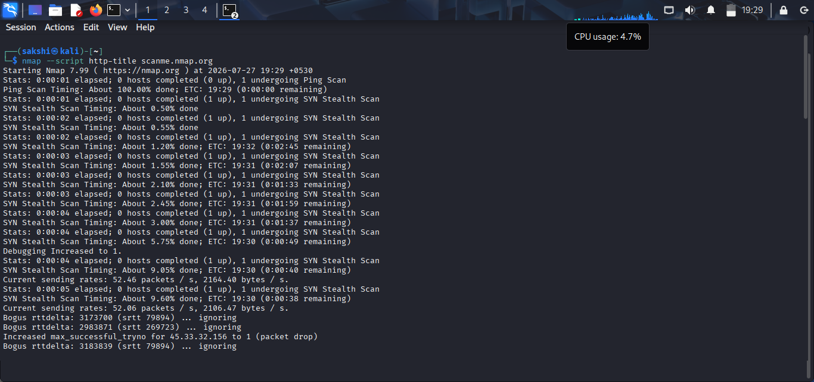
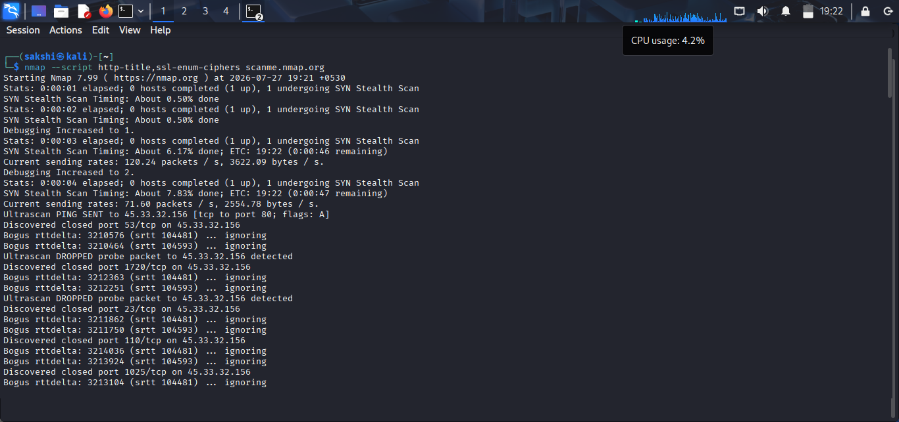
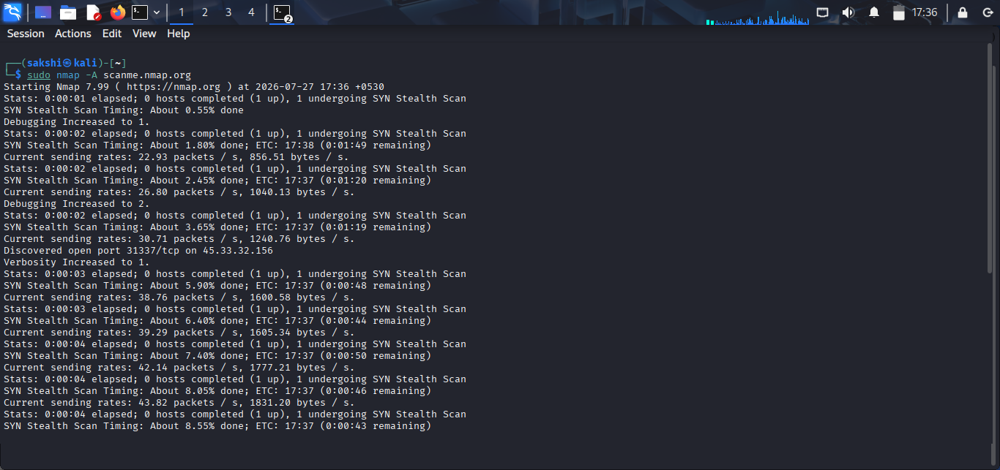

# Nmap Scripting Engine (Practical)

## 🎯 Objective

In this practical, you will learn how to use Nmap Scripting Engine (NSE) to automate scanning, gather detailed information, and detect vulnerabilities.

---

# Lab Environment

- OS: Kali Linux
- Tool: Nmap
- Target: scanme.nmap.org or lab machine

---

# Practical 1: Default Script Scan

## Command

```bash
nmap -sC scanme.nmap.org
```

### Purpose

Runs default safe scripts to gather basic information about the target.

### Expected Output

- HTTP titles
- Basic service info
- Safe enumeration results

> 

---

# Practical 2: Service + Script Scan

## Command

```bash
nmap -sC -sV scanme.nmap.org
```

### Purpose

Combines service version detection with default NSE scripts for deeper analysis.

### Expected Output

- Open ports
- Service versions
- Script results (HTTP, SSL, etc.)

> 

---

# Practical 3: Run Vulnerability Scripts

## Command

```bash
nmap --script vuln scanme.nmap.org
```

### Purpose

Checks for known vulnerabilities in services running on the target.

### Expected Output

- Vulnerability warnings (if any)
- Misconfiguration details

> 

---

# Practical 4: Specific Script Execution

## Command

```bash
nmap --script http-title scanme.nmap.org
```

### Purpose

Retrieves the title of the web page hosted on the target.

### Expected Output

- Website title

> 

---

# Practical 5: Multiple Scripts

## Command

```bash
nmap --script http-title,ssl-enum-ciphers scanme.nmap.org
```

### Purpose

Runs multiple scripts at the same time for detailed enumeration.

### Expected Output

- HTTP information
- SSL/TLS cipher details

> 

---

# Practical 6: Aggressive Script Scan

## Command

```bash
sudo nmap -A scanme.nmap.org
```

### Purpose

Performs an aggressive scan that includes:
- OS detection
- Version detection
- NSE scripts
- Traceroute

> 

---

# 📊 Summary of Commands

| Command | Purpose |
|--------|--------|
| `-sC` | Default safe scripts |
| `-sC -sV` | Scripts + version detection |
| `--script vuln` | Vulnerability scanning |
| `--script http-title` | Web page title extraction |
| `--script multiple` | Run multiple scripts |
| `-A` | Aggressive scan (all-in-one) |

---

# 🔎 Key Observations

- NSE automates reconnaissance tasks.
- `-sC` is safe and widely used.
- `--script vuln` helps detect vulnerabilities.
- `-A` provides full detailed scanning.
- Script results depend on target configuration.

---

# 🛡️ Security Perspective

NSE is used in cybersecurity to:

- Detect vulnerabilities automatically.
- Enumerate services in detail.
- Identify misconfigurations.
- Perform security audits.
- Speed up penetration testing.

---

# 💼 Real-World Example

A penetration tester runs:

```bash
nmap -sC -sV target.com
```

The scan reveals:
- Apache server running
- SSL misconfiguration
- Exposed HTTP title

This helps identify weak points in the system.

---

# ⭐ Best Practices

- Use `-sC` for safe default scans.
- Avoid intrusive scripts on production systems.
- Combine NSE with `-sV` and `-O`.
- Review script documentation before use.
- Use only on authorized targets.

---

# ❓ Interview Questions

### 1. What is NSE in Nmap?

### 2. What does `-sC` do?

### 3. What is the purpose of `--script vuln`?

### 4. What is the difference between `-sC` and `-A`?

### 5. Why is NSE important in penetration testing?

### 6. Can NSE scripts be dangerous?

### 7. What is the use of multiple scripts in one scan?

---

# 🎯 Key Takeaway

Nmap Scripting Engine automates advanced scanning tasks like vulnerability detection, service enumeration, and system analysis. It is a powerful feature for cybersecurity professionals and penetration testers.
