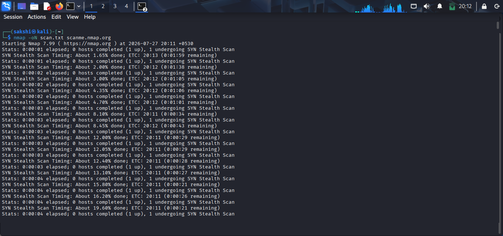
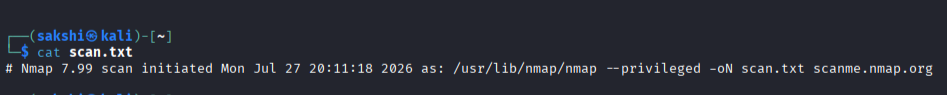
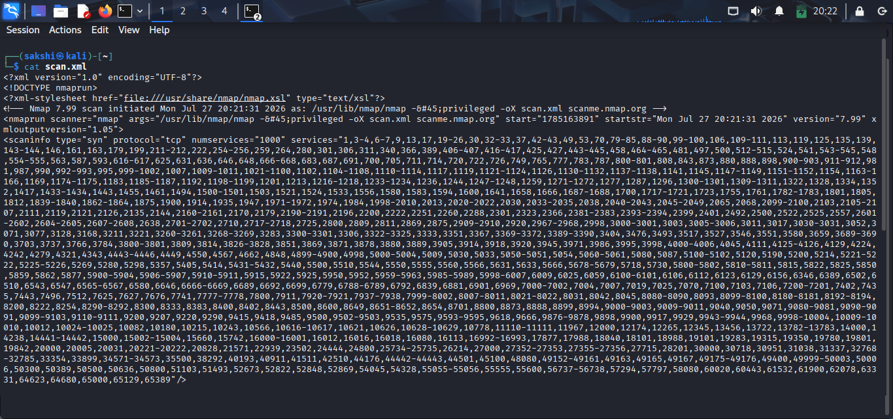
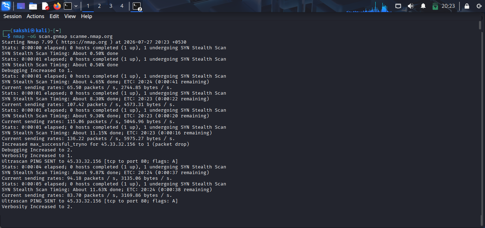
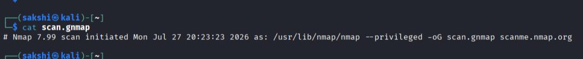
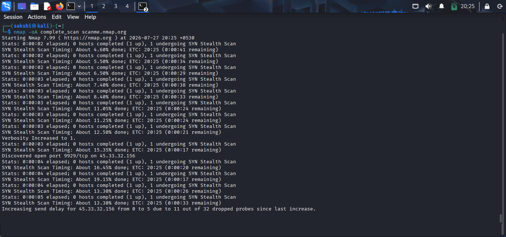
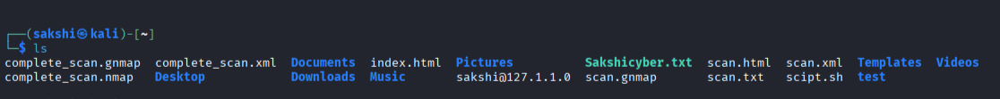
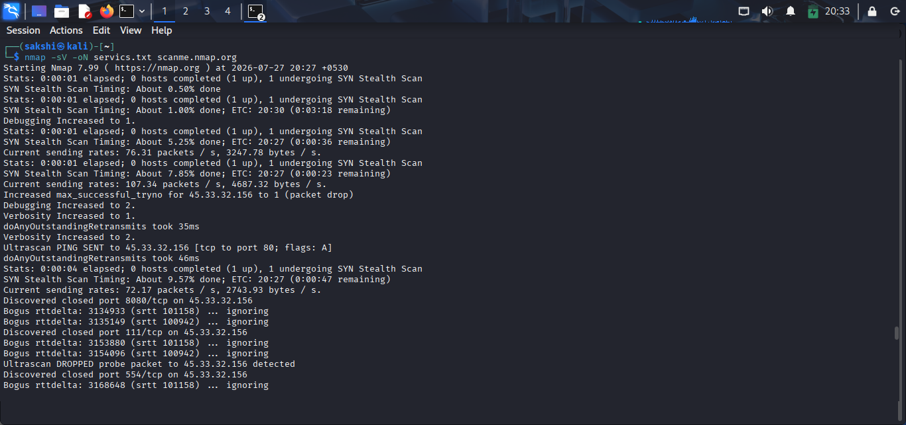
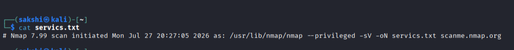
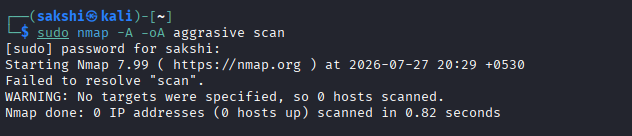

# Output Formats (Practical)

## 🎯 Objective

In this practical, you will learn how to save Nmap scan results in different output formats for reporting, analysis, and documentation.

---

# Lab Environment

- Operating System: Kali Linux
- Tool: Nmap
- Target: scanme.nmap.org or your lab machine

---

# Practical 1: Save Output in Normal Format

## Command

```bash
nmap -oN scan.txt scanme.nmap.org
```

### Purpose

Saves scan results in a human-readable text file.

### Verify the File

```bash
cat scan.txt
```

> 
> 

---

# Practical 2: Save Output in XML Format

## Command

```bash
nmap -oX scan.xml scanme.nmap.org
```

### Purpose

Saves scan results in XML format for automation and integration with security tools.

### Verify the File

```bash
cat scan.xml
```

> 
> 

---

# Practical 3: Save Output in Grepable Format

## Command

```bash
nmap -oG scan.gnmap scanme.nmap.org
```

### Purpose

Saves scan results in grepable format for quick filtering and scripting.

### Verify the File

```bash
cat scan.gnmap
```

> 
> 

---

# Practical 4: Save Output in All Formats

## Command

```bash
nmap -oA complete_scan scanme.nmap.org
```

### Purpose

Generates all major output formats at once.

### Verify the Files

```bash
ls
```

Expected files:

```
complete_scan.nmap
complete_scan.xml
complete_scan.gnmap
```

> 
> 

---

# Practical 5: Combine Version Detection with Output

## Command

```bash
nmap -sV -oN services.txt scanme.nmap.org
```

### Purpose

Saves service and version detection results in a text file.

> 
> 

---

# Practical 6: Combine Aggressive Scan with Output

## Command

```bash
sudo nmap -A -oA aggressive_scan scanme.nmap.org
```

### Purpose

Performs an aggressive scan and saves the results in all output formats.

> 

---

# Summary of Commands

| Command | Purpose |
|---------|---------|
| `-oN` | Save output in text format |
| `-oX` | Save output in XML format |
| `-oG` | Save output in grepable format |
| `-oA` | Save output in all formats |
| `-sV -oN` | Save service detection report |
| `-A -oA` | Save aggressive scan report |

---

# Key Observations

- `.nmap` files are easy for humans to read.
- `.xml` files are useful for automation and importing into other tools.
- `.gnmap` files are optimized for command-line searching.
- `-oA` is the most convenient option because it generates all major formats.

---

# Best Practices

- Use meaningful file names.
- Store scan reports securely.
- Save important scans using `-oA`.
- Review output files after every scan.
- Archive reports for future comparison.

---

# Practical Completed

- ✅ Normal Output
- ✅ XML Output
- ✅ Grepable Output
- ✅ All Output Formats
- ✅ Service Scan Report
- ✅ Aggressive Scan Report

---

# 🎯 Key Takeaway

Saving scan results in different output formats makes documentation, reporting, automation, and future analysis much easier. In professional environments, using `-oA` is a common best practice because it generates all major report formats in a single command.
