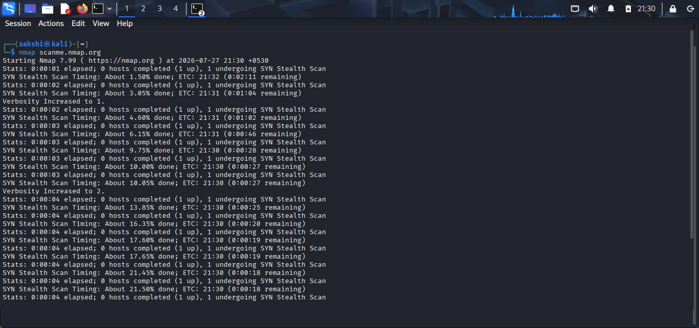
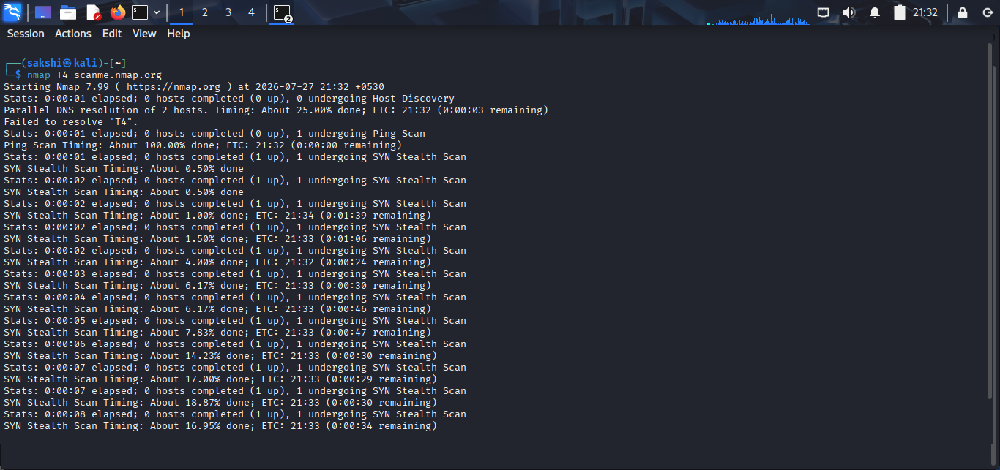
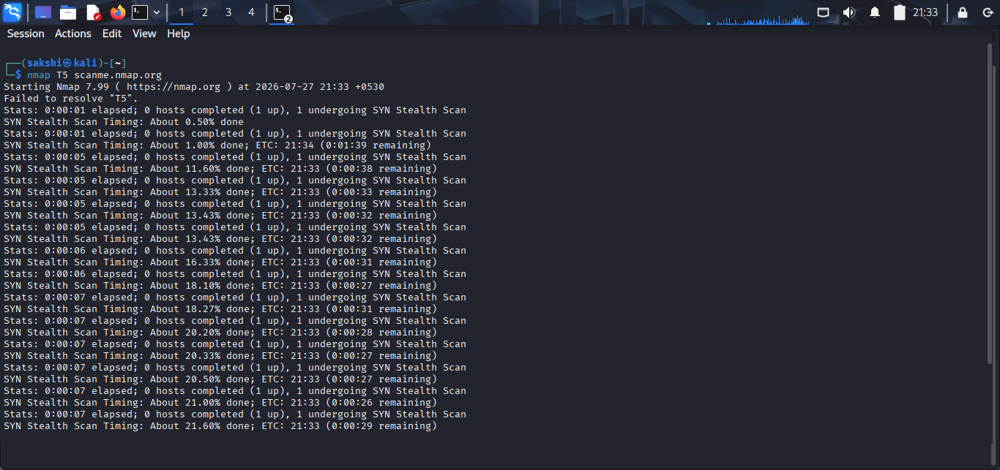
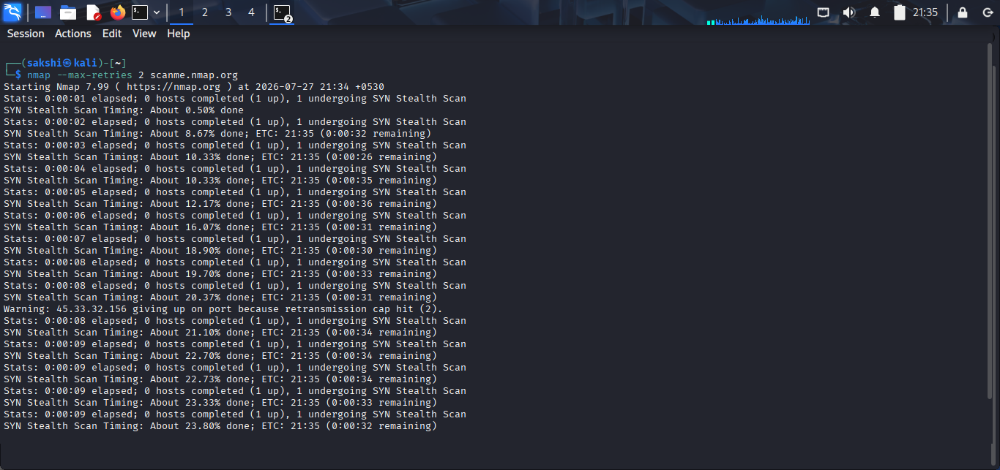
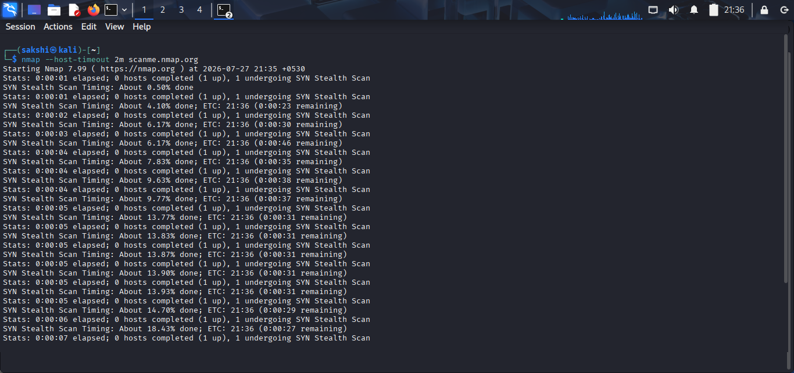
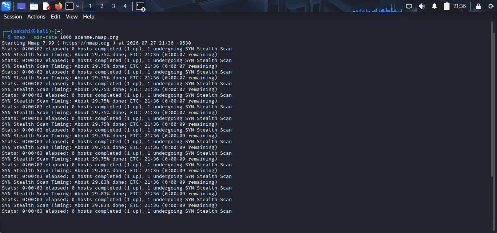
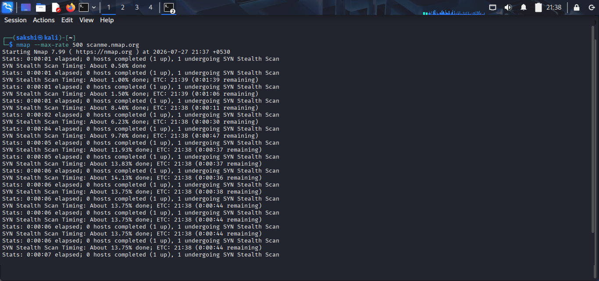
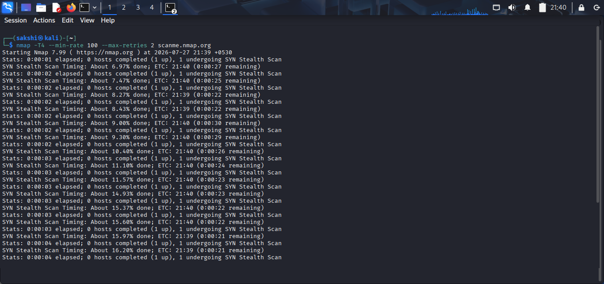

# Timing & Performance (Practical)

## 🎯 Objective

In this practical, you will learn how to optimize Nmap scans using timing templates and performance tuning options.

---

# Lab Environment

- Operating System: Kali Linux
- Tool: Nmap
- Target: scanme.nmap.org or your lab machine

---

# Practical 1: Default Timing Scan

## Command

```bash
nmap scanme.nmap.org
```

### Purpose

Runs a scan using Nmap's default timing template (`-T3`).

### Expected Output

- Open ports
- Running services
- Standard scan duration

> 

---

# Practical 2: Aggressive Timing

## Command

```bash
nmap -T4 scanme.nmap.org
```

### Purpose

Performs a faster scan on stable networks.

### Expected Output

- Faster scan completion
- Similar port detection

> 

---

# Practical 3: Insane Timing

## Command

```bash
nmap -T5 scanme.nmap.org
```

### Purpose

Runs the fastest timing template.

### Expected Output

- Very fast scan
- Possible missed results on slow networks

> 

---

# Practical 4: Add Scan Delay

## Command

```bash
nmap --scan-delay 1s scanme.nmap.org
```

### Purpose

Adds a 1-second delay between probe packets.

> 
---

# Practical 5: Limit Retries

## Command

```bash
nmap --max-retries 2 scanme.nmap.org
```

### Purpose

Limits packet retransmissions to reduce scan time.

> 

---

# Practical 6: Set Host Timeout

## Command

```bash
nmap --host-timeout 2m scanme.nmap.org
```

### Purpose

Stops scanning the target if it exceeds 2 minutes.

> 

---

# Practical 7: Set Minimum Packet Rate

## Command

```bash
nmap --min-rate 1000 scanme.nmap.org
```

### Purpose

Ensures Nmap sends at least 1000 packets per second.

> 

---

# Practical 8: Set Maximum Packet Rate

## Command

```bash
nmap --max-rate 500 scanme.nmap.org
```

### Purpose

Limits the packet transmission rate to 500 packets per second.

> 

---

# Practical 9: Combine Timing Options

## Command

```bash
nmap -T4 --min-rate 1000 --max-retries 2 scanme.nmap.org
```

### Purpose

Optimizes scan speed while limiting retries.

> 

---

# Summary of Commands

| Command | Purpose |
|---------|---------|
| `nmap` | Default timing (`-T3`) |
| `nmap -T4` | Aggressive timing |
| `nmap -T5` | Maximum speed |
| `--scan-delay` | Delay between probes |
| `--max-retries` | Limit retransmissions |
| `--host-timeout` | Stop long-running scans |
| `--min-rate` | Minimum packet rate |
| `--max-rate` | Maximum packet rate |
| `-T4 --min-rate --max-retries` | Combined optimization |

---

# Key Observations

- `-T4` is faster than the default scan.
- `-T5` is suitable mainly for lab environments.
- Scan delays reduce scan speed but may help avoid detection.
- Lower retry values reduce scan time but may miss responses.
- Packet rate settings directly affect scan performance.

---

# Security Perspective

Timing optimization helps security professionals:

- Scan large networks efficiently.
- Reduce network congestion.
- Balance speed and reliability.
- Improve operational efficiency during assessments.

---

# Best Practices

- Use `-T3` for general scanning.
- Use `-T4` for internal assessments.
- Avoid `-T5` on production networks.
- Adjust packet rates based on network capacity.
- Validate important results with additional scans.

---

# Practical Completed

- ✅ Default Timing
- ✅ T4 Scan
- ✅ T5 Scan
- ✅ Scan Delay
- ✅ Maximum Retries
- ✅ Host Timeout
- ✅ Minimum Rate
- ✅ Maximum Rate
- ✅ Combined Performance Scan

---

# 🎯 Key Takeaway

Timing and performance options allow you to customize Nmap scans for speed, reliability, and stealth. Proper tuning improves scan efficiency while reducing unnecessary network impact.
