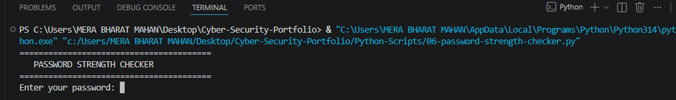

# 🔐 Password Security Tool

## 📌 Project Overview

Password Security Tool is a Python-based cybersecurity project that analyzes password strength and generates secure passwords based on modern security best practices.

The project demonstrates fundamental cybersecurity concepts including password complexity, authentication security, randomness, and secure password generation. It is designed as a beginner-friendly security automation project while following industry-recommended password guidelines.

---

## 🎯 Objective

The main objectives of this project are:

- Understand password security principles
- Learn password complexity requirements
- Analyze password strength
- Generate strong and random passwords
- Improve cybersecurity awareness
- Practice Python programming for security automation

---

## 🛠️ Tools & Technologies Used

- Python 3
- Random Library
- String Library
- Regular Expressions (Regex)
- Linux Environment
- VS Code

---

## ⚙️ Features

- Generate strong random passwords
- Analyze password strength
- Validate password complexity
- Detect weak passwords
- Check password length
- Verify uppercase and lowercase letters
- Verify numbers and special characters
- Provide security recommendations

---

## 🧠 How It Works

The tool follows these steps:

1. Takes a password as input from the user.
2. Checks password length.
3. Detects uppercase letters.
4. Detects lowercase letters.
5. Detects numbers.
6. Detects special characters.
7. Calculates password strength.
8. Displays the security rating.
9. Suggests improvements if the password is weak.
10. Generates a strong random password when requested.

---

## 🔍 Password Evaluation Criteria

The password is evaluated using multiple security parameters:

- Minimum password length
- Uppercase letters (A–Z)
- Lowercase letters (a–z)
- Numbers (0–9)
- Special characters (!@#$%^&*)
- Overall complexity

---

## 💻 Implementation Details

The project is implemented using Python and consists of two major modules:

### Password Strength Checker

- Accepts user password
- Performs security validation
- Calculates password strength
- Displays improvement suggestions

### Password Generator

- Generates secure random passwords
- Uses letters, numbers, and symbols
- Creates passwords with high entropy

---

## 📖 Code Explanation

### Random Module

Used for generating secure random passwords.

### String Module

Provides predefined character sets such as:

- Uppercase letters
- Lowercase letters
- Digits
- Special symbols

### Regular Expressions (Regex)

Used to validate password complexity by checking different character patterns.

---

## 🔒 Security Best Practices

This project follows several password security principles:

- Use passwords with at least 12 characters
- Include uppercase and lowercase letters
- Include numbers
- Include special characters
- Avoid dictionary words
- Avoid personal information
- Use unique passwords for every account
- Never share passwords
- Use a password manager whenever possible
- Enable Multi-Factor Authentication (MFA)

---

## 📂 Project Structure

```
Password-Security-Tool/
│
├── password_security.py
├── README.md
├── requirements.txt
└── screenshots/
    ├── running-project.png
    ├── password-analysis.png
    ├── password-generated.png
    └── security-score.png
```

---

## 📸 Screenshots

### Running the project

>

### Password entered

>

### Password strength analysis

>

### Strong password generated

>

---

## 🚀 Future Improvements

- Password breach checking
- Password history analysis
- GUI version using Tkinter
- Password manager integration
- Password hashing
- Export reports
- Strength visualization
- Dark mode interface

---

## 📈 Learning Outcomes

This project helped in understanding:

- Password security
- Authentication concepts
- Secure password generation
- Regex validation
- Python programming
- Cybersecurity automation
- Secure coding practices

---

## 📌 Project Status

✅ Completed

---

## 👩‍💻 Author

**Sakshi Devda**

Cybersecurity Enthusiast | SOC Analyst Aspirant

---

## 📄 License

This project is created for educational and portfolio purposes.
