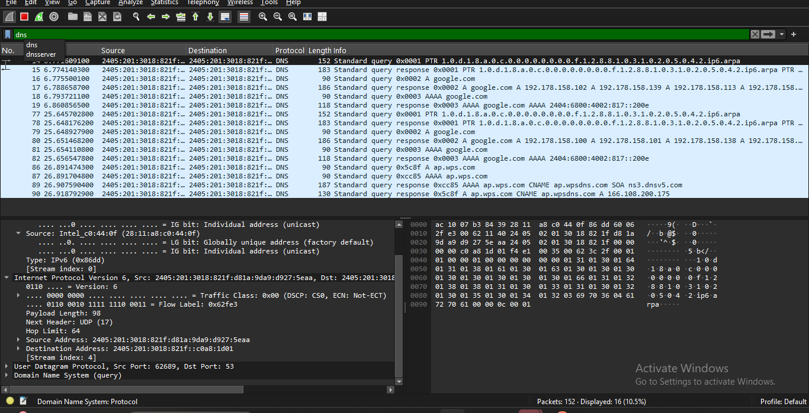
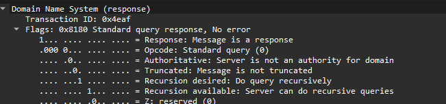
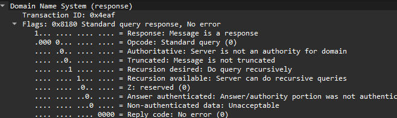

# DNS Analysis Lab

## 🎯 Lab Objective

Capture and analyze DNS traffic to identify how a domain name is resolved into an IP address using Wireshark.

---

# Scenario

You are working as a Junior SOC Analyst.

A user reports that they visited a suspicious website after clicking a link received in an email. Your task is to investigate the DNS traffic and determine which domain was queried and what IP address was returned.

---

# Lab Requirements

- Wireshark Installed
- Npcap Installed
- Internet Connection
- Administrator Privileges

---

# Task 1

Start Wireshark.

Select your active network interface.

Begin packet capture.

---

# Task 2

Generate DNS traffic by performing one of the following actions:

- Open a website in your browser.
- Run the following command:

```bash
nslookup google.com
```

Wait for the DNS request and response to complete.

---

# Task 3

Stop packet capture.

---

# Task 4

Apply the following Display Filter:

```text
dns
```

Only DNS packets should now be displayed.

---

# Task 5

Identify the DNS Query packet.

Record the following information:

| Field | Value |
|--------|-------|
| Source IP | |
| Destination IP | |
| Requested Domain | |
| Query Type | |

---

# Task 6

Locate the corresponding DNS Response packet.

Record the following information:

| Field | Value |
|--------|-------|
| Returned IP Address | |
| Response Code | |
| Record Type | |
| Time Taken | |

---

# Task 7

Expand the **Domain Name System (DNS)** section and answer the following questions.

### Which domain was requested?

Answer:

google.com

---

### Was the DNS query successful?

Answer:

Yes, the DNS query was successful.

---

### Which protocol transported the DNS packet?

Answer:

UDP

---

# Expected Output

You should observe:

```
DNS Query
        ↓
DNS Response
        ↓
Returned IP Address
```

The DNS response should contain the IP address associated with the requested domain.

---

### Live Packet Capture

>

---

### Applying the `dns` Display Filter

>

---

### DNS Query Packet

>

---

### DNS Response Packet

>

---

### DNS Packet Details

>

---

# Lab Analysis

During the investigation, the DNS Query packet was identified and matched with its corresponding DNS Response. The requested domain name, returned IP address, and record type were successfully analyzed. This confirmed how DNS resolves domain names before a connection to the destination server is established.

---

# What I Learned

- How DNS queries and responses work.
- How to identify DNS packets in Wireshark.
- How to extract domain names and IP addresses.
- How DNS analysis supports network troubleshooting and cybersecurity investigations.

---

# Conclusion

This lab demonstrated how DNS traffic can be captured and analyzed using Wireshark. By examining DNS Query and DNS Response packets, we verified the domain resolution process and learned how DNS analysis helps detect suspicious domains, troubleshoot connectivity issues, and support cybersecurity investigations.
