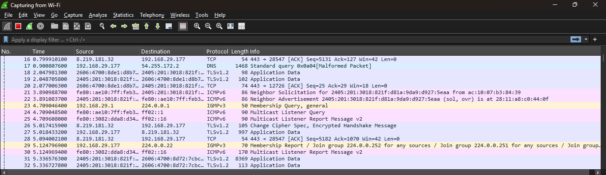
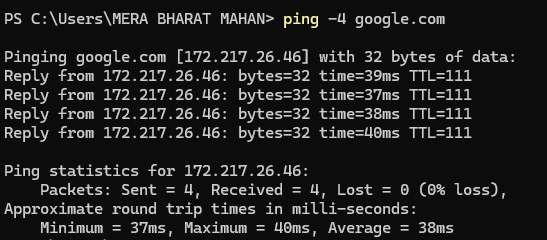
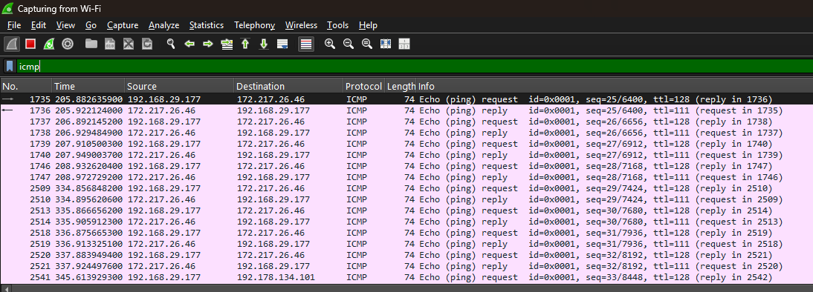
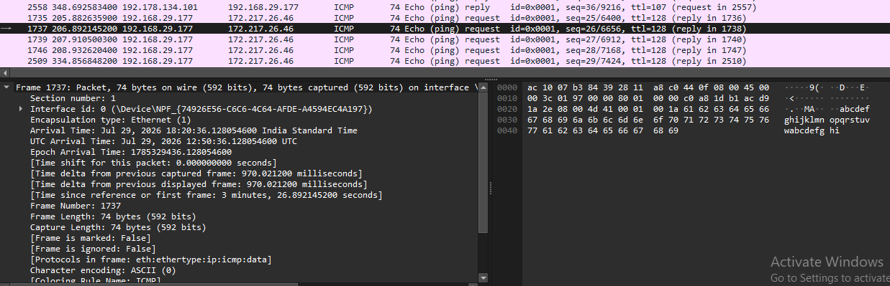
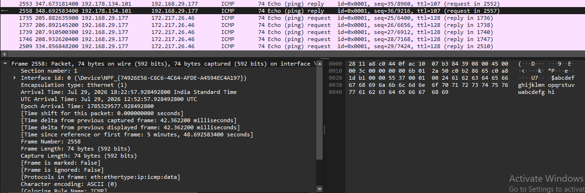
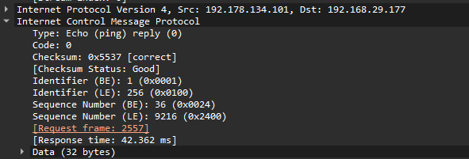

# ICMP Analysis Lab

## 🎯 Lab Objective

Capture and analyze ICMP traffic using Wireshark to verify network connectivity and identify Echo Request and Echo Reply packets.

---

# Scenario

You are working as a Junior Network Security Analyst.

A user reports that they are unable to reach a remote server. Your task is to determine whether the ICMP packets are reaching the destination and whether the destination is responding.

Use Wireshark to capture and analyze the ICMP communication.

---

# Lab Requirements

- Wireshark Installed
- Npcap Installed
- Internet Connection
- Administrator Privileges

---

# Task 1

Start Wireshark.

Select your active network interface.

Begin packet capture.

---

# Task 2

Open Command Prompt.

Run the following command:

```bash
ping google.com
```

Allow all ping requests to complete.

---

# Task 3

Stop packet capture.

---

# Task 4

Apply the following Display Filter:

```text
icmp
```

Only ICMP packets should now be displayed.

---

# Task 5

Locate the ICMP Echo Request packet.

Record the following information.

| Field | Value |
|--------|-------|
| Source IP | |
| Destination IP | |
| ICMP Type | |
| ICMP Code | |
| Sequence Number | |

---

# Task 6

Locate the corresponding ICMP Echo Reply packet.

Record the following information.

| Field | Value |
|--------|-------|
| Source IP | |
| Destination IP | |
| ICMP Type | |
| ICMP Code | |
| Sequence Number | |
| Response Time | |

---

# Task 7

Expand the **Internet Control Message Protocol (ICMP)** section and answer the following questions.

### Was the Echo Request sent successfully?

Answer:

Yes, the Echo Request was sent successfully.

---

### Was an Echo Reply received?

Answer:

Yes, an Echo Reply was received.

---

### Do the Request and Reply have the same Sequence Number?

Answer:

Yes, the Echo Request and Echo Reply have the same Sequence Number.

---

### Was the destination host reachable?

Answer:

Yes, the destination host was reachable.

---

# Expected Output

You should observe:

```
Echo Request
      │
      ▼
Destination Host
      │
      ▼
Echo Reply
```

This confirms successful network communication between the client and the destination.

---

# 📸 Screenshots

### Wireshark Capturing ICMP Traffic

>

---

### Running the `ping` Command

>

---

### Applying the `icmp` Display filter

>

---

### ICMP Echo Request Packet

>

---

### ICMP Echo Reply Packet

>

---

### ICMP Packet Details

>

---

# Lab Analysis

The ICMP Echo Request packets were successfully transmitted to the destination host. The destination responded with ICMP Echo Reply packets, confirming successful connectivity. The matching Sequence Numbers and valid response time verified that the communication was successful.

---

# What I Learned

- How to generate ICMP traffic using the `ping` command.
- How to identify Echo Request and Echo Reply packets.
- How to verify network connectivity using Wireshark.
- How ICMP analysis assists in troubleshooting and cybersecurity investigations.

---

# Conclusion

This lab demonstrated how to capture and analyze ICMP traffic using Wireshark. By examining Echo Request and Echo Reply packets, we confirmed successful communication between devices and learned how ICMP analysis is used for network diagnostics, troubleshooting, and incident investigations.
