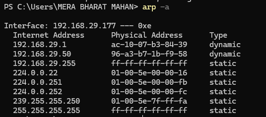
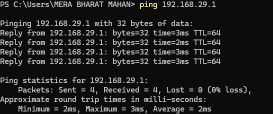
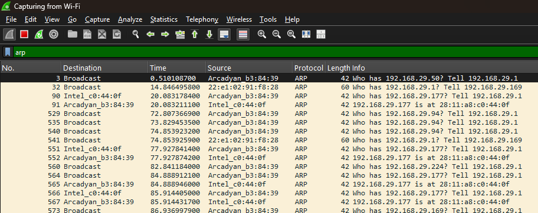
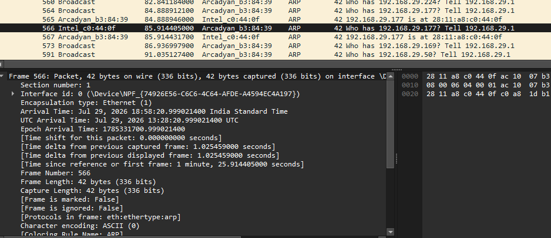
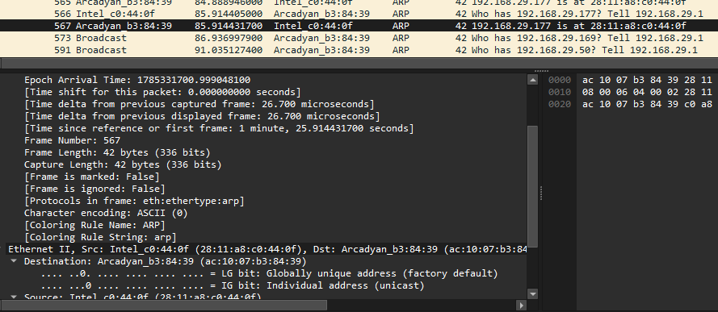
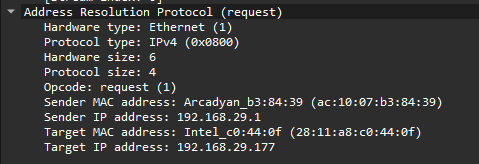
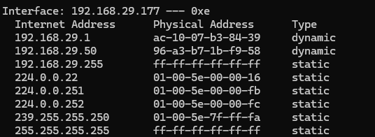

# ARP Analysis Lab

## 🎯 Lab Objective

Capture and analyze ARP traffic using Wireshark to identify ARP Requests, ARP Replies, and detect signs of suspicious ARP activity.

---

# Scenario

You are working as a Junior SOC Analyst.

Users in the office report intermittent network connectivity issues. Your team suspects that the problem may be related to abnormal ARP traffic or a possible ARP Spoofing attack.

Your task is to capture the network traffic using Wireshark, analyze the ARP packets, and determine whether the ARP communication appears normal or suspicious.

---

# Lab Requirements

- Wireshark Installed
- Npcap Installed
- Internet Connection
- Administrator Privileges
- Local Area Network (LAN)

---

# Task 1

Start Wireshark.

Select your active network interface.

Begin packet capture.

---

# Task 2

Generate ARP traffic.

Open Command Prompt and run:

```bash
arp -a
```

Then ping your default gateway.

Example:

```bash
ping 192.168.1.1
```

Wait until the ping process completes.

---

# Task 3

Stop packet capture.

---

# Task 4

Apply the following Display Filter.

```text
arp
```

Only ARP packets should now be displayed.

---

# Task 5

Locate an ARP Request packet.

Record the following information.

| Field | Value |
|--------|-------|
| Sender IP Address | |
| Sender MAC Address | |
| Target IP Address | |
| Target MAC Address | |
| Opcode | |

---

# Task 6

Locate the corresponding ARP Reply packet.

Record the following information.

| Field | Value |
|--------|-------|
| Sender IP Address | |
| Sender MAC Address | |
| Target IP Address | |
| Target MAC Address | |
| Opcode | |

---

# Task 7

Inspect the captured ARP traffic and answer the following questions.

### Was an ARP Request observed?

Answer:

Yes, an ARP Request was observed.

---

### Was an ARP Reply received?

Answer:

Yes, an ARP Reply was received.

---

### Did the ARP Reply provide a valid MAC address?

Answer:

Yes, the ARP Reply provided a valid MAC address.

---

### Did you observe multiple MAC addresses claiming the same IP address?

Answer:

No, multiple MAC addresses claiming the same IP address were not observed.

---

### Does the captured traffic indicate possible ARP Spoofing?

Answer:

No, the captured traffic does not indicate possible ARP Spoofing.

---

# Indicators of Possible ARP Spoofing

While reviewing the packets, look for signs such as:

- Multiple MAC addresses associated with the same IP address.
- Frequent unsolicited ARP Replies.
- Unexpected changes in IP-to-MAC mappings.
- Duplicate ARP Replies from different devices.

> **Note:** In a normal home or lab network, you will usually **not** observe ARP Spoofing. This section helps you understand what to look for during a real security investigation.

---

# Expected Output

A normal ARP exchange should appear similar to:

```
Client
      │
      ▼
ARP Request
"Who has 192.168.1.1?"
      │
      ▼
Gateway
      │
      ▼
ARP Reply
"192.168.1.1 is at AA:BB:CC:DD:EE:FF"
```

---

# 📸 Screenshots

### Running the `arp -a` Command

>

---

### Running the `ping` Command

>

---

### Applying the `arp` Display Filter

>

---

### ARP Request Packet

>

---

### ARP Reply Packet

>

---

### ARP Packet Details

>

---

### Updated ARP Cache

>

---

# Lab Analysis

The captured traffic showed a standard ARP Request followed by an ARP Reply containing the correct MAC address for the requested IP address. No duplicate MAC addresses or abnormal ARP Replies were observed, indicating normal ARP communication during the capture.

---

# What I Learned

- How ARP resolves IP addresses into MAC addresses.
- How to identify ARP Requests and Replies in Wireshark.
- How to inspect ARP packet fields.
- How to recognize common indicators of ARP Spoofing.
- How ARP analysis supports network troubleshooting and cybersecurity investigations.

---

# Conclusion

This lab demonstrated how to capture and analyze ARP traffic using Wireshark. By examining ARP Requests and ARP Replies, we verified normal address resolution within a local network. We also learned how abnormal ARP behavior can indicate potential ARP Spoofing attacks, making ARP analysis an important skill for network administrators and cybersecurity professionals.
