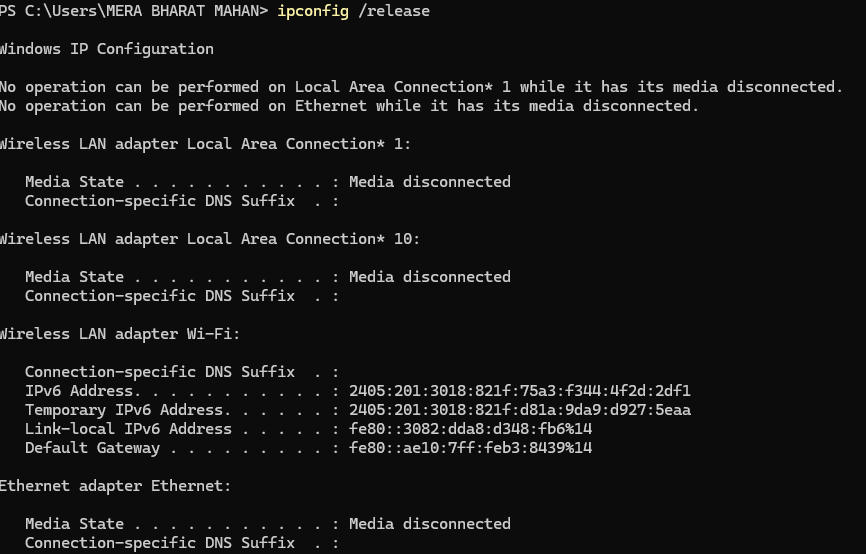
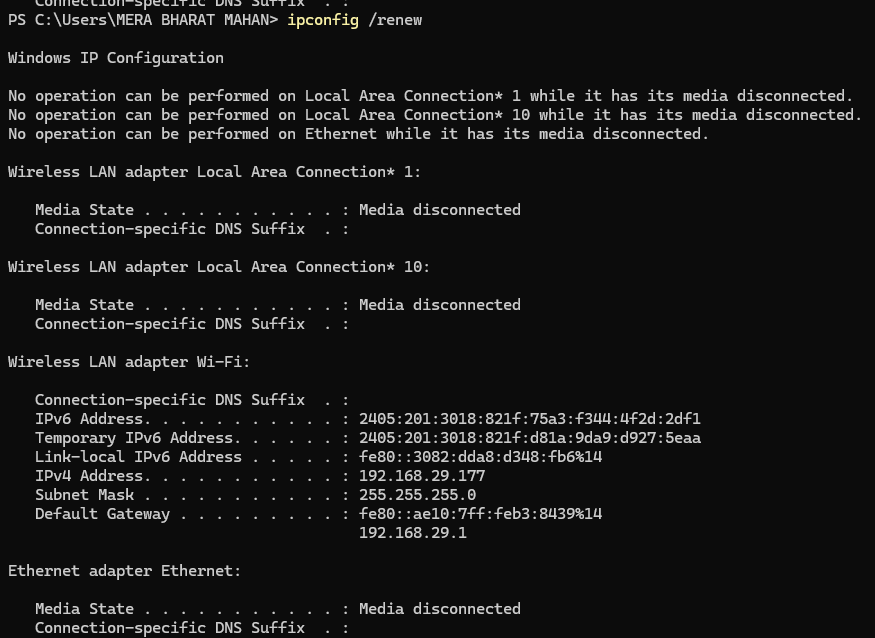
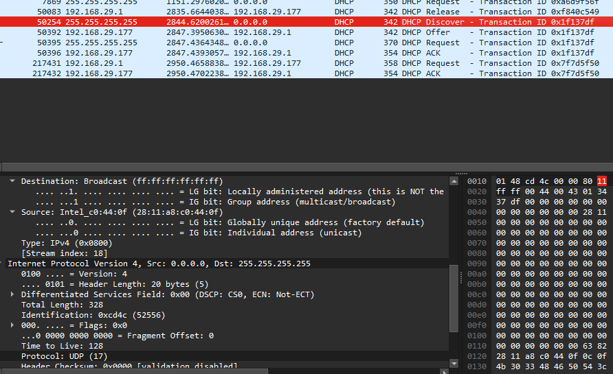
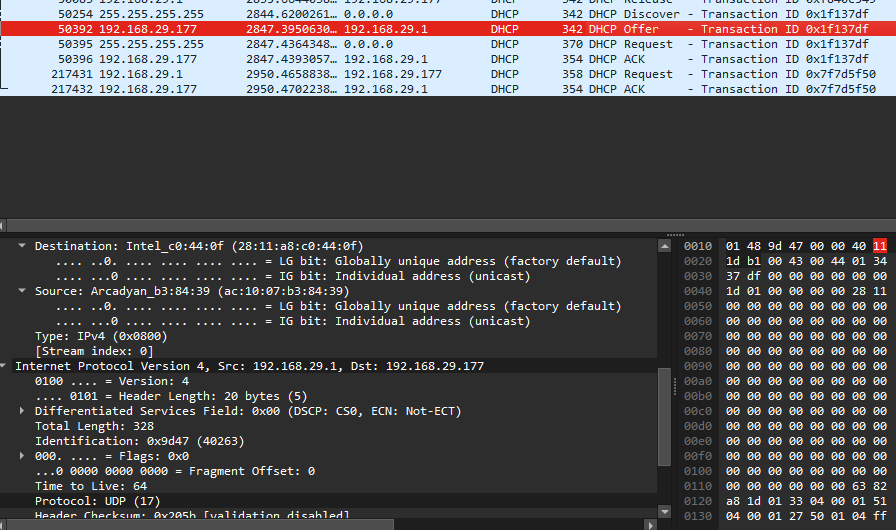
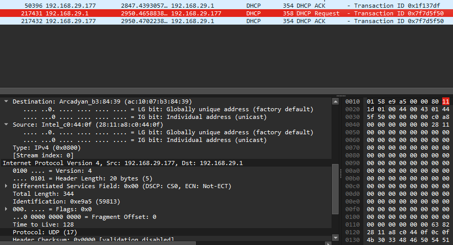
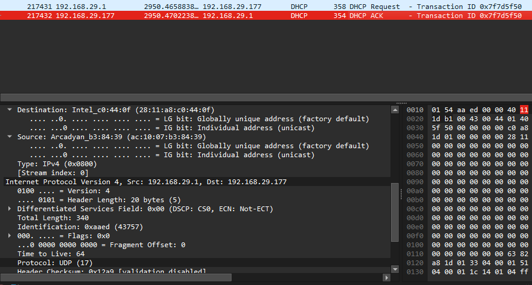
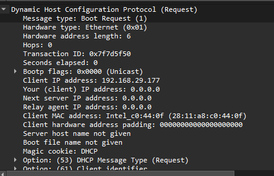
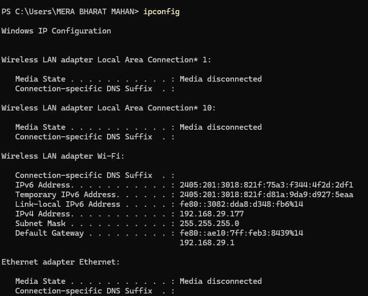

# DHCP Analysis Lab

## 🎯 Lab Objective

Capture and analyze DHCP traffic using Wireshark to investigate why a client is unable to obtain an IP address from the DHCP server.

---

# Scenario

You are working as a Junior SOC Analyst.

A new employee connects their laptop to the office network, but the system displays **"No Internet Access"** and receives an **APIPA (169.254.x.x)** IP address instead of a valid network IP.

Your task is to analyze the DHCP traffic in Wireshark and determine where the DHCP process failed.

---

# Lab Requirements

- Wireshark Installed
- Npcap Installed
- DHCP-enabled Network
- Administrator Privileges

---

# Task 1

Start Wireshark.

Select the active network interface.

Begin packet capture.

---

# Task 2

Generate DHCP traffic.

Open **Command Prompt** as Administrator.

Run:

```bash
ipconfig /release

ipconfig /renew
```

Wait until the process completes.

---

# Task 3

Stop packet capture.

---

# Task 4

Apply the following Display Filter:

```text
bootp
```

Only DHCP packets should now be displayed.

---

# Task 5

Locate the DHCP packets and identify whether the complete DORA process occurred.

Record your observations.

| DHCP Message | Observed (Yes/No) |
|--------------|-------------------|
| DHCP Discover | |
| DHCP Offer | |
| DHCP Request | |
| DHCP ACK | |

---

# Task 6

Select the DHCP packets and record the following information.

| Field | Value |
|--------|-------|
| Client MAC Address | |
| DHCP Server IP | |
| Assigned IP Address | |
| Lease Time | |
| Transaction ID | |

---

# Task 7

Answer the following questions.

### Was a DHCP Discover packet sent?

Answer:

Yes, a DHCP Discover packet was sent.

---

### Did the DHCP Server respond with a DHCP Offer?

Answer:

Yes, the DHCP Server responded with a DHCP Offer.

---

### Did the client send a DHCP Request?

Answer:

Yes, the client sent a DHCP Request.

---

### Was a DHCP ACK received?

Answer:

Yes, a DHCP ACK was received.

---

### Was an IP address successfully assigned?

Answer:

Yes, an IP address was successfully assigned.

---

### At which stage did the DORA process fail (if any)?

Answer:

The DORA process did not fail. All four stages (Discover, Offer, Request, and ACK) completed successfully.

---

# Possible Causes

If the client does not receive an IP address, possible reasons include:

- DHCP Server is unavailable.
- Network cable or Wi-Fi connection issue.
- DHCP service is stopped.
- Firewall blocking DHCP traffic.
- DHCP Scope is exhausted.
- Rogue DHCP Server on the network.

---

# 📸 Screenshots

### Running `ipconfig /release`

>

---

### Running `ipconfig /renew`

>

---

### Applying the `bootp` Display Filter

>

---

### DHCP Discover Packet

>

---

### DHCP Offer Packet

>

---

### DHCP Request Packet

>

---

### DHCP ACK Packet

>

---

### DHCP Packet Details

>

---

### Verifying the Assigned IP Address using `ipconfig`

>

---

# Lab Analysis

The DHCP packets were analyzed to verify the DORA process. If all four DHCP messages (Discover, Offer, Request, and ACK) were present, the client successfully received an IP address. If any message was missing, the point of failure was identified and possible causes were investigated.

---

# What I Learned

- How DHCP automatically assigns IP addresses.
- How to capture DHCP packets in Wireshark.
- How to identify the DORA process.
- How to troubleshoot DHCP-related issues.
- How to investigate IP assignment failures.

---

# Conclusion

This lab demonstrated how to analyze DHCP communication using Wireshark. By examining the DORA process, it was possible to determine whether the client successfully obtained an IP address or identify the stage where the process failed. DHCP analysis is an essential skill for network administrators and cybersecurity professionals when troubleshooting network connectivity issues.
