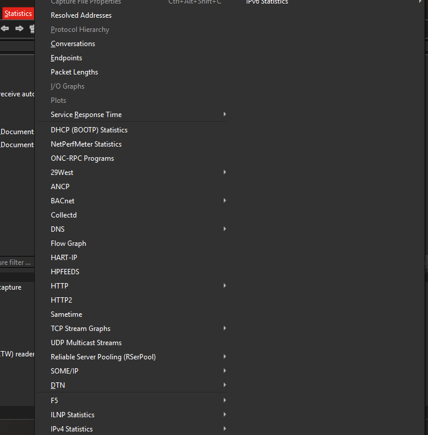
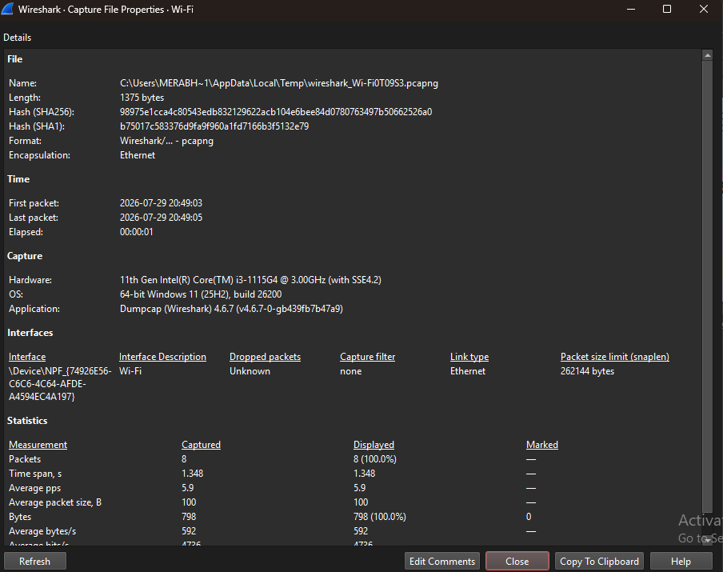
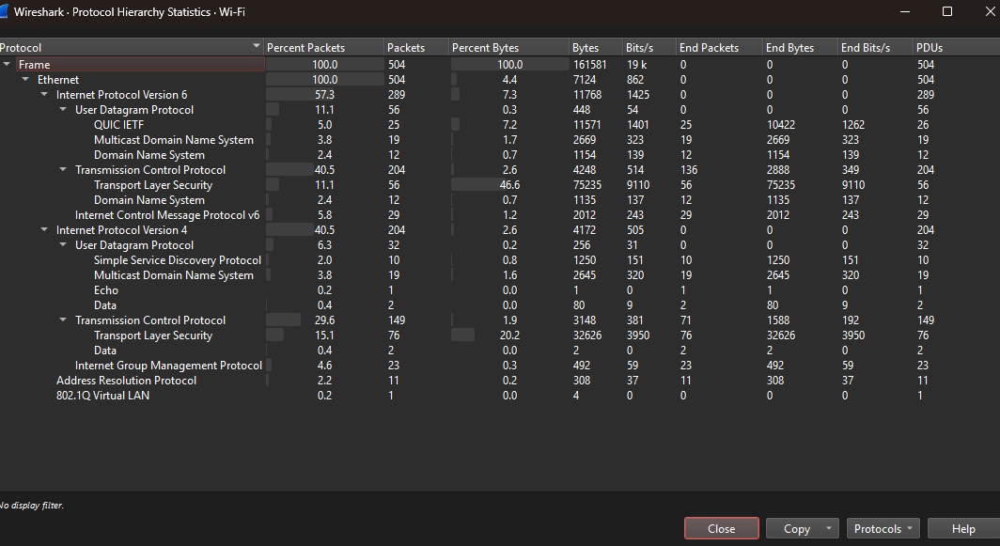
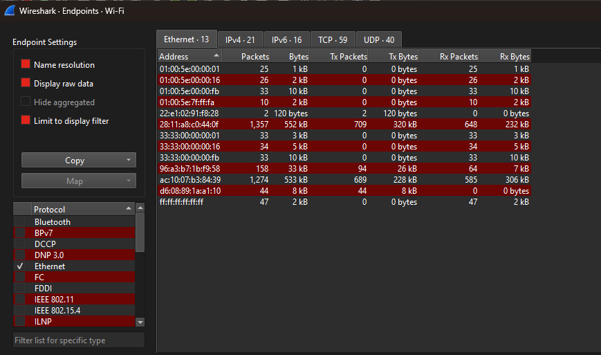
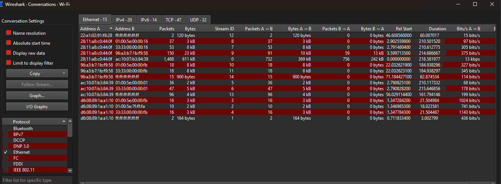
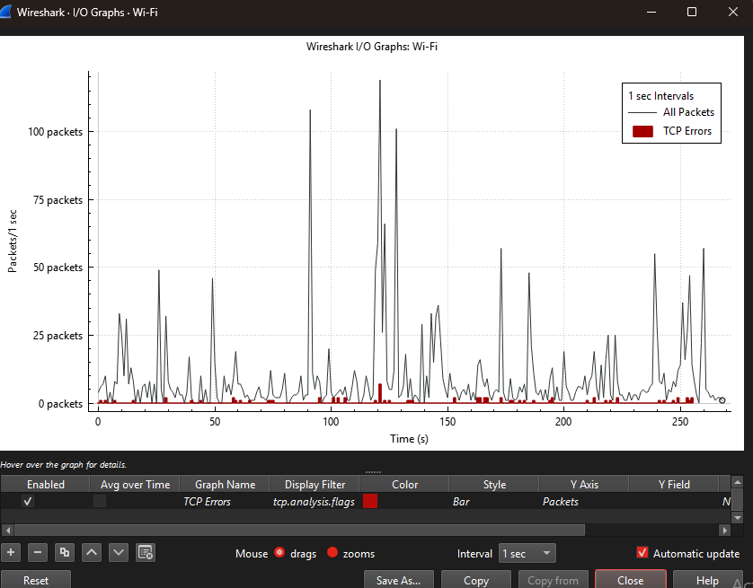
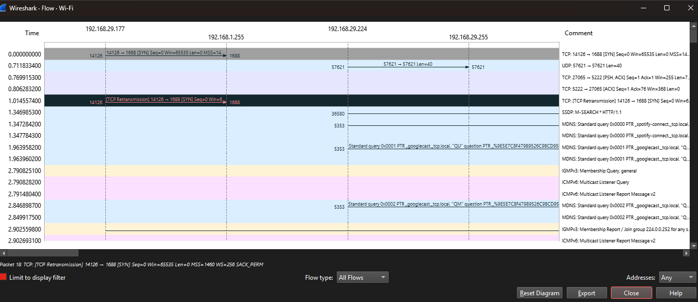

# Wireshark Statistics - Practical

## 1. Introduction

Wireshark Statistics tools help analyze captured network traffic by providing detailed information about packets, protocols, endpoints, and communication patterns.

In this practical, we will explore different Statistics features available in Wireshark.

Wireshark Statistics is useful for:

- Network traffic analysis
- Protocol identification
- Host discovery
- Communication analysis
- Security investigation

---

# 2. Opening Statistics Menu

## Steps:

1. Open Wireshark

2. Open a capture file or start live capture

3. Click on:

```
Analyze → Statistics
```

From here, different statistical analysis tools can be accessed.

---

# 3. Capture Summary

## Steps:

Go to:

```
Statistics → Capture File Properties
```

## Information Available:

- Total packets captured
- Capture duration
- Packet rate
- File size
- Start and end time of capture

## Purpose:

Capture Summary provides a quick overview of the captured network traffic.

## Security Use:

- Understand the size of captured traffic.
- Check the duration of network activity.
- Get initial information during investigation.

---

# 4. Protocol Hierarchy Analysis

## Steps:

Go to:

```
Statistics → Protocol Hierarchy
```

## Analyze:

- Protocol names
- Packet count
- Percentage of traffic
- Bytes transferred

## Example:

TCP may show higher traffic because many applications use TCP connections for reliable communication.

## Security Use:

Protocol Hierarchy helps analysts:

- Identify unknown protocols.
- Detect unusual network traffic.
- Understand application usage in the network.

---

# 5. Endpoint Analysis

## Steps:

Go to:

```
Statistics → Endpoints
```

Select:

- IPv4
- IPv6
- Ethernet

## Analyze:

- IP addresses
- MAC addresses
- Packet count
- Bytes transferred
- Sent and received traffic

## Security Use:

Endpoint analysis helps to:

- Find active hosts in the network.
- Identify unknown devices.
- Analyze communication between systems.

---

# 6. Conversation Analysis

## Steps:

Go to:

```
Statistics → Conversations
```

Select protocol type:

- TCP
- UDP
- Ethernet

## Analyze:

- Source address
- Destination address
- Packets exchanged
- Bytes transferred
- Communication duration

## Security Use:

Conversation analysis helps to:

- Identify important communication sessions.
- Find suspicious connections.
- Investigate possible attacker communication.

---

# 7. I/O Graph Analysis

## Steps:

Go to:

```
Statistics → I/O Graph
```

## Observe:

- Packet rate
- Traffic spikes
- Network activity over time

## Security Use:

I/O Graph helps detect:

- Unusual traffic patterns.
- Sudden increase in network activity.
- Possible DoS/DDoS behavior.

---

# 8. Flow Graph Analysis

## Steps:

Go to:

```
Statistics → Flow Graph
```

Select:

- General Flow
- TCP Flow

## Observe:

- Communication sequence
- Request and response packets
- Client-server interaction

## Security Use:

Flow Graph helps security analysts:

- Understand communication flow.
- Analyze suspicious connections.
- Follow packet exchange between systems.

---

# 9. Useful Display Filters with Statistics

## Find TCP Traffic

Filter:

```
tcp
```

Purpose:

Displays all TCP communication.

---

## Find UDP Traffic

Filter:

```
udp
```

Purpose:

Displays UDP-based communication.

---

## Find HTTP Traffic

Filter:

```
http
```

Purpose:

Analyze web-based traffic.

Security Use:

- Monitor website communication.
- Identify suspicious HTTP requests.

---

## Find DNS Queries

Filter:

```
dns
```

Purpose:

Analyze DNS requests and responses.

Security Use:

- Detect malicious domains.
- Investigate DNS-based attacks.
- Identify suspicious domain lookups.

---

## Find Traffic From Specific IP Address

Filter:

```
ip.addr == 192.168.1.10
```

Purpose:

Shows all traffic related to a specific IP address.

---

## Find Communication Between Two Hosts

Filter:

```
ip.addr == 192.168.1.10 && ip.addr == 192.168.1.20
```

Purpose:

Analyze traffic between two systems.

---

## Find Failed TCP Connections

Filter:

```
tcp.flags.reset == 1
```

Purpose:

Shows TCP reset packets.

Security Use:

- Identify failed connections.
- Detect possible scanning activity.

---

## Find DNS Queries For A Domain

Filter:

```
dns.qry.name contains "example"
```

Purpose:

Search DNS requests for a specific domain.

Security Use:

- Investigate suspicious domains.
- Analyze malware communication.

---

# 10. Security Analysis Using Wireshark Statistics

Wireshark Statistics features help security professionals in:

- Network monitoring
- Traffic analysis
- Incident response
- Threat detection
- Troubleshooting network issues

Security analysts use these statistics to identify:

- Unknown hosts
- Suspicious communication
- Abnormal traffic patterns
- Unauthorized protocols
- Possible attacks

---

# 11. Practical Screenshots

---

## 1. Statistics Menu

>

---

## 2. Capture File Properties

>

---

## 3. Protocol Hierarchy

>

---

## 4. Endpoint Analysis

>

---

## 5. Conversation Analysis

>

---

## 6. I/O Graph

>

---

## 7. Flow Graph

>

---

# 12. Conclusion

Wireshark Statistics provides powerful tools for analyzing captured network traffic.

It helps security professionals to:

- Understand network communication.
- Identify active systems.
- Analyze protocols.
- Detect suspicious activities.
- Perform network investigations.

Wireshark Statistics is an important skill for SOC Analysts, Network Analysts, and Security Professionals.
