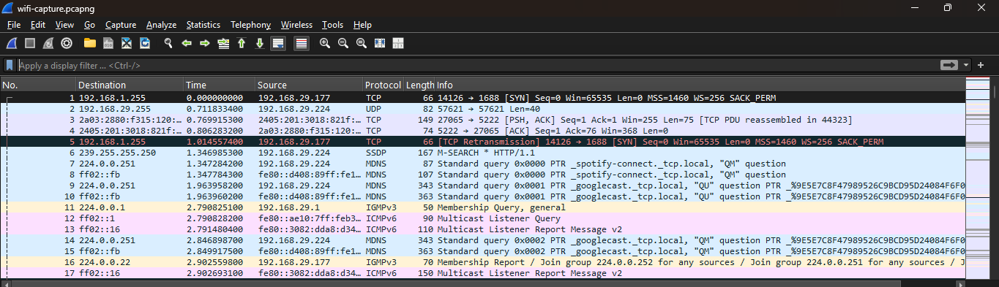
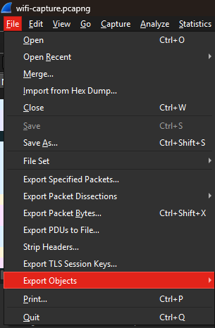
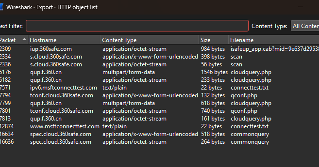
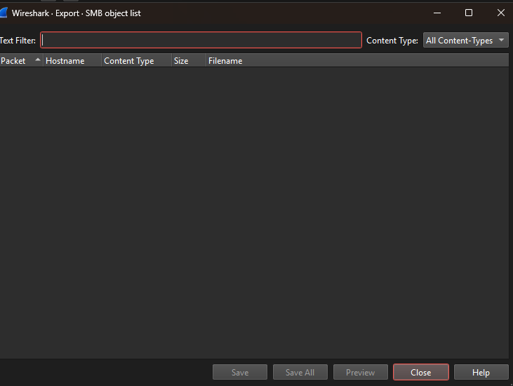
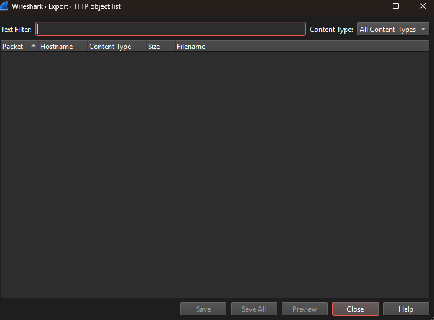
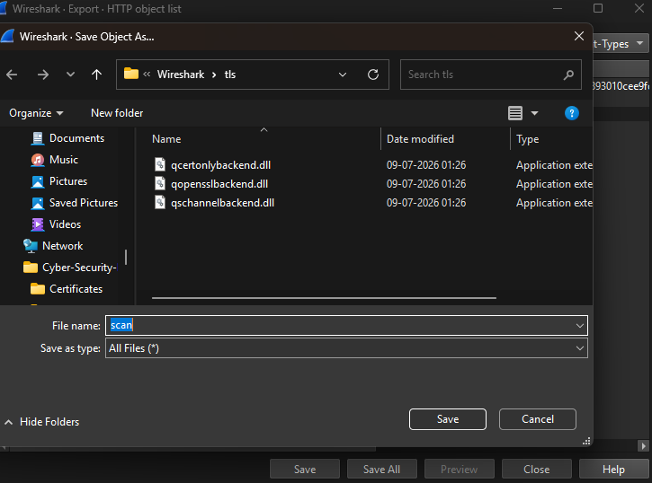
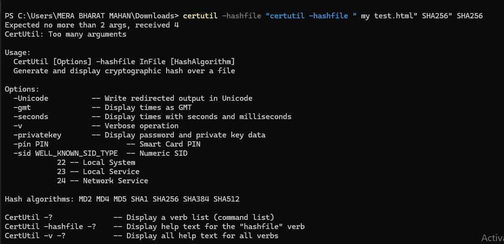

# Export Objects - Practical

## 1. Introduction

Wireshark Export Objects allows analysts to extract files transferred through captured network traffic.

In this practical, we will extract objects from supported protocols using Wireshark.

Export Objects is useful during:

- Network investigations
- Malware analysis
- Incident response
- Data recovery from packet captures

---

# 2. Requirements

## Tools:

- Wireshark
- PCAP file containing HTTP/SMB/TFTP traffic

## Knowledge Required:

- Basic Wireshark navigation
- Packet capture analysis
- Network protocols understanding

---

# 3. Opening a Capture File

## Steps:

1. Open Wireshark.

2. Click:

```
File → Open
```

3. Select the PCAP file.

4. Wait for packets to load completely.

---

# 4. Export HTTP Objects

## Steps:

Go to:

```
File → Export Objects → HTTP
```

Wireshark will display available HTTP objects transferred through captured traffic.

## Information Shown:

- Filename
- Content type
- Packet number
- Size
- Host information

## Extraction Process:

1. Select the required object.

2. Click:

```
Save
```

3. Choose the destination folder.

The selected file will be extracted from the packet capture.

## Example:

HTTP traffic may contain:

- Images
- Documents
- Text files
- Downloaded files

---

# 5. Export SMB Objects

## Steps:

Go to:

```
File → Export Objects → SMB
```

View available SMB transferred files.

## Process:

1. Select the required file.

2. Click:

```
Save
```

3. Store the extracted file locally.

## Purpose:

Used for analyzing Windows file-sharing traffic.

## Security Use:

SMB object extraction helps analysts:

- Investigate file transfers.
- Analyze suspicious files.
- Recover files from network captures.

---

# 6. Export TFTP Objects

## Steps:

Go to:

```
File → Export Objects → TFTP
```

Select the available transferred object.

Save the file locally.

## Security Use:

TFTP analysis can help identify:

- Unauthorized file transfers.
- Network device configuration transfers.
- Suspicious activity.

---

# 7. Verify Extracted Files

After extraction:

## Check:

- File name
- File extension
- File size
- File content

## Calculate File Hash (Optional):

Example:

```
sha256sum filename
```

Hash verification helps to:

- Confirm file integrity.
- Compare files with known malicious hashes.
- Support malware analysis.

---

# 8. Security Analysis Using Export Objects

Wireshark Export Objects helps security analysts to:

- Recover files from network traffic.
- Analyze downloaded files.
- Investigate suspicious transfers.
- Extract malware samples from PCAP files.
- Perform incident response analysis.

## Common Investigation Scenarios:

### Malware Investigation:

Extract suspicious files from captured traffic and analyze them.

### Data Exfiltration Detection:

Identify unauthorized files leaving the network.

### Incident Response:

Recover transferred files during security investigations.

---

# 9. Useful Display Filters

## Find HTTP Traffic:

```
http
```

Purpose:

Display HTTP communication.

---

## Find SMB Traffic:

```
smb
```

Purpose:

Analyze Windows file-sharing traffic.

---

## Find TFTP Traffic:

```
tftp
```

Purpose:

Analyze TFTP file transfers.

---

## Find File Transfer Packets:

```
tcp.stream eq 0
```

Purpose:

Follow a specific TCP communication stream.

---

# 10. Follow Network Stream

## Steps:

Right-click on a packet:

```
Follow → TCP Stream
```

Analyze:

- Complete communication
- Request and response data
- Transferred information

## Security Use:

Helps understand:

- Client-server communication.
- Data exchanged between systems.
- Suspicious network activity.

---

# 11. Practical Screenshots

## 1. Opening PCAP File

>

---

## 2. Export Objects Menu

>

---

## 3. HTTP Objects List

>

---

## 4. SMB Objects List

>

---

## 5. TFTP Objects List

>

---

## 6. Extracted File

>

---

## 7. File Hash Verification

>

---

# 12. Conclusion

Wireshark Export Objects is a powerful feature for extracting files from captured network traffic.

It helps security professionals in:

- Digital forensics
- Malware analysis
- Incident response
- Network investigation

By extracting and analyzing transferred objects, analysts can identify suspicious files, investigate attacks, and understand network activities.